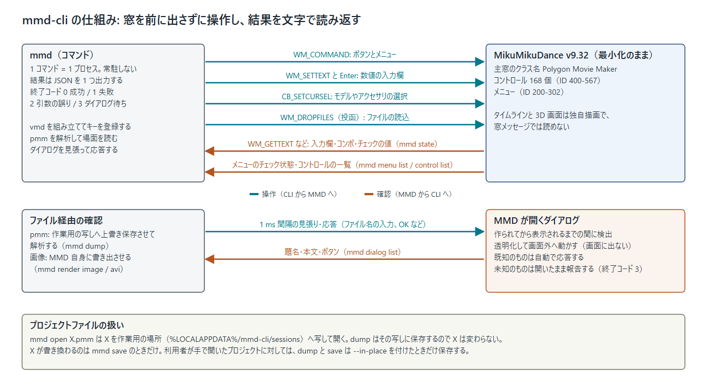
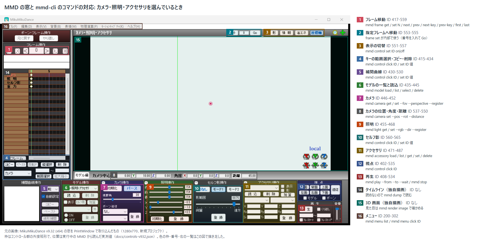
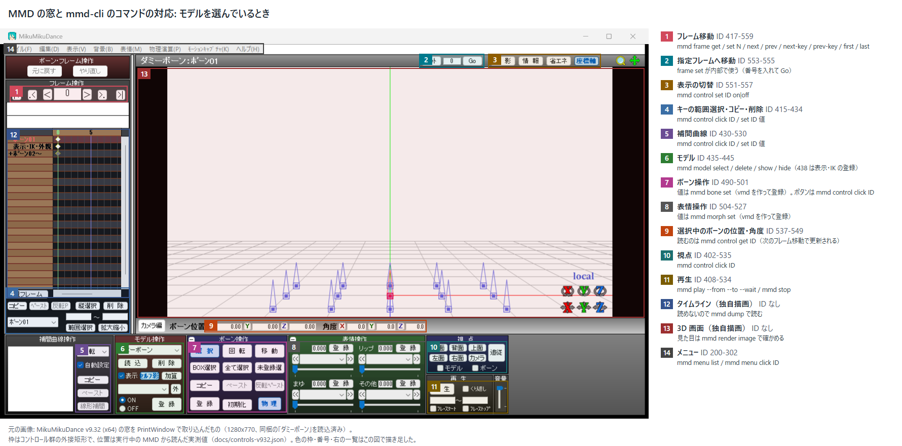

# mmd-cli

MikuMikuDance（MMD）を、窓を前に出さずにコマンドラインから操作する道具。
同じ PC で人が別の作業をしている間に、エージェント（Claude など）やスクリプトが裏で MMD を動かすために作った。

- MMD は最小化のまま動かす。前面に出さず、入力の焦点も奪わない。
- 操作の途中で MMD が開くダイアログは、画面に出る前に隠して自動で応答する。
- 結果は JSON で返る。画面の取り込み（スクリーンショット）を見なくても、何が起きたかを確かめられる。
- 見た目を確かめたいときは、MMD 自身に画像ファイルを書き出させる。

対象は MikuMikuDance v9.32（x64、日本語表示）と Windows。Python 3.9 以上、標準ライブラリのみ。
MMD 本体・モデル・モーションはこのリポジトリに含まれない。



## 導入

```
git clone https://github.com/kakuteki/mmd-cli.git
cd mmd-cli
python -m pip install --user -e .
mmd --version          # 入らない場合は python -m mmd_cli --version
```

MMD 本体は配布元（VPVP）から入手して、任意の場所に展開しておく。

## 使い方

```
mmd launch --exe C:/tools/MikuMikuDance_v932x64/MikuMikuDance.exe   # 最小化で起動。2 回目以降は --exe を省ける
mmd model load C:/models/miku/miku.pmx
mmd bone set 右腕 --rot 0 0 35 --frame 30      # フレーム 30 に右腕のキーを登録
mmd morph set まばたき 1.0                     # 現在のフレームに表情のキーを登録
mmd camera set --pos 0 12 0 --rot 5 20 0 --distance 28 --register
mmd render image C:/work/shot.png --size 640 360
mmd save C:/work/scene.pmm
mmd quit
```

それぞれのコマンドは JSON を 1 つ出す。上の `bone set` の結果（`--out` で書いたファイルの中身）:

```json
{"ok": true, "bone": "右腕", "frame": 30, "pos": [0.0, 0.0, 0.0], "rot": [0.0, 0.0, 35.0]}
```

`mmd model load` の結果には、MMD が出した「モデル情報」ダイアログの本文（モデルのコメント）と、
自動で応答したダイアログの記録が入る。

```json
{"ok": true, "name": "初音ミク", "index": 0,
 "comment": "PolyMo用モデルデータ：初音ミク ver.1.3\n(物理演算対応モデル)\n...",
 "answered_dialogs": [{"kind": "model_info", "title": "モデル情報", "buttons": ["OK", "キャンセル"], "action": "ok"}]}
```

## ヘッドレスで使う

画面に何も出さずに使うには、`--headless` で起動する。主窓は非表示（タスクバーにも出ない）のまま動き、
ダイアログは従来どおり画面に出ない。`mmd window show` で最小化状態に戻せる。
MMD は AVI の書き出しを始めるときに自分で主窓を表示するが、mmd-cli は各コマンドの間、非表示の主窓を画面外に
置いておき、表示されても画面には出さず、終わったら隠し直す（結果の `answered_dialogs` に `hidden again` と残る）。

```
mmd launch --headless --exe C:/tools/MikuMikuDance_v932x64/MikuMikuDance.exe
mmd model load C:/models/miku/miku.pmx
mmd render image C:/work/shot.png
mmd quit
```

SSH 越し・CI・サービスのように **利用者のデスクトップの外** から呼ばれたときは、`mmd` は自分をタスクスケジューラの
一回限りのタスクとして、ログオン中の利用者のデスクトップセッションの中で走らせ、その結果を返す（結果の JSON に
`"relayed": true` が付く）。窓メッセージはデスクトップセッションを越えて届かず、MMD 自体もデスクトップの無い
セッションでは起動が終わらないためである（v9.32 で実測）。

- 利用者がそのマシンにログオンしていることが必要。モニタは要らない（仮想ディスプレイでも、切断された
  セッションでもよい）。誰もログオンしていなければ、その旨のエラーになる。
- タスクは `pythonw.exe` で走るので、デスクトップにコンソール窓は出ない。タスクは終わると消す。
  電源条件の無い XML 定義で作るので、ノート PC がバッテリー駆動でも始まる（`schtasks /Create` の既定は AC 電源のときだけ）。
- `--no-relay` で止められる。デスクトップの中にいても `--in-user-session` で強制できる。
- 待っている側で Ctrl-C しても、デスクトップ側の子は止めない（書き込みやダイアログの途中で止めると半端な状態が残る）。
  子はそのまま終わり、結果は捨てられる。
- `mmd file info` のようにファイルだけを扱うコマンドは、どこでもそのまま走る。
- 確認済み: 別の機から SSH で入ったセッション 0 から、起動（非表示）・読込・キー登録・書き出し・終了まで
  中継で通り、その間デスクトップの前面の窓は変わらず、MMD の窓は一度も表示されなかった。

## 台本をまとめて流す（batch）

1 コマンド 1 プロセスだと、起動・接続・（中継なら）タスクの登録で 1 回あたり 1〜3 秒かかる。
何十手もある台本は `mmd batch` で 1 プロセスにまとめる。

```
mmd batch script.txt            # 1 行 1 コマンド。'-' なら標準入力
mmd batch script.txt --keep-going   # 失敗した行で止めず最後まで
```

```
# script.txt   コメントと空行は飛ばす。mmd の後ろに書く形で 1 行ずつ
new
model load "C:\models\miku\miku.pmx"
frame set 30
["bone", "set", "右腕", "--rot", "0", "0", "35"]
{"id": "wink", "args": ["morph", "set", "ウィンク", "1.0"]}
render image C:\work\shot.png --size 640 360
```

行はそのまま空白で区切り、二重引用符で囲めば 1 語になる。バックスラッシュはそのまま。引用の心配をしたくなければ
JSON の配列か `{"id": ..., "args": [...]}` で書く。`--pid` などの共通オプションは `mmd batch` 側に付ける。

結果は `{"ok", "ran", "failed", "exit_code", "results": [...]}` で、`results` の各要素が行ごとの結果（行番号・引数・
その行の JSON、応答したダイアログ）。既定では失敗した行で止まり、終了コードはその行のもの（1 失敗 / 2 引数の誤り /
3 ダイアログ待ち）。`launch` を台本に入れれば、起動したインスタンスを続く行がそのまま使う。

## 状態の確かめ方

| 知りたいこと | コマンド | 仕組み |
| --- | --- | --- |
| 今の様子（モデル一覧・選択・フレーム・再生中か・保留ダイアログ） | `mmd state` | 入力欄やコンボボックスの値を読む |
| 場面の全体（キーフレーム、現在のポーズ、カメラ、照明、アクセサリ、音） | `mmd dump`、キーの一覧まで欲しいときは `mmd dump --keys` | 作業用の pmm に上書き保存させて解析する |
| 1 つのボーン・表情の現在値 | `mmd bone get 名前` / `mmd morph get 名前` | 同上 |
| カメラ・照明の値 | `mmd camera get` / `mmd light get` | 入力欄の値を読む |
| 見た目 | `mmd render image out.png` | MMD の「画像ファイルに出力」 |
| vmd / vpd / pmm ファイルの中身 | `mmd file info ファイル` | MMD を使わずに解析する |

角度は MMD の窓に表示される値と同じ（度）。ボーンの回転は四元数（`--quat X Y Z W`）でも指定できる。

`mmd dump` の例（モデル 1 体、フレーム 30 に右腕と まばたき のキーがある場面）:

```json
{"ok": true, "frame": 30, "last_frame": 30, "view_size": [640, 360], "mode": "model", "selected_model": 0,
 "models": [{"index": 0, "name": "初音ミク", "path": "C:\\tools\\MikuMikuDance_v932x64\\UserFile\\Model\\初音ミク.pmd",
   "visible": true, "bone_count": 122, "morph_count": 16, "last_frame": 30,
   "key_counts": {"bones": 1, "morphs": 1},
   "current": {"bones": {"右腕": {"pos": [0.0, 0.0, 0.0], "rot": [0.0, 0.0, 35.0]}}, "morphs": {"まばたき": 1.0}}}],
 "camera": {"current_is": "editing view",
   "keys": [{"frame": 0, "pos": [0.0, 10.0, 0.0], "rot": [0.0, 0.0, 0.0], "distance": 45.0, "fov": 30, "perspective": true},
            {"frame": 30, "pos": [0.0, 12.0, 0.0], "rot": [5.0, 20.0, 0.0], "distance": 28.0, "fov": 30, "perspective": true}]},
 "light": {"current": {"rgb": [154, 154, 154], "dir": [-0.5, -1.0, 0.5]}},
 "accessories": [], "wave": {"enabled": false, "path": ""}}
```

（一部の項目を省いてある。モデルを選択している間、`camera.current` は MMD の編集用の視点になる。
場面のカメラは `camera.keys` か `mmd camera get` で見る。）

## 出力

- 標準出力は常に ASCII。日本語などは `\uXXXX` に逃がすので、端末の文字コードが何であっても壊れない。
- 日本語をそのまま読みたいときは `--out FILE` を付ける。結果を UTF-8 でファイルに書き、標準出力にはその場所だけを出す。
- 成功は `{"ok": true, ...}`、失敗は `{"ok": false, "error": {"type": ..., "message": ...}}`。
- 終了コード: 0 成功 / 1 失敗 / 2 引数の誤り / 3 MMD がダイアログで待っている。

共通オプションはコマンド名の前に置く。

```
mmd [--pid N] [--out FILE] [--timeout 秒] [--in-place] [--in-user-session | --no-relay] コマンド ...
```

対象の MMD は、`--pid`、環境変数 `MMD_CLI_PID`、`mmd launch` が最後に起動したもの、唯一起動しているもの、の順で決まる。
`mmd ps` で起動中の一覧が出る。

## コマンド

| コマンド | 内容 |
| --- | --- |
| `ps` / `launch [--exe P] [--headless]` / `quit [--force]` | 一覧・起動（最小化、または非表示）・終了 |
| `state` / `dump [--keys]` | 状態の読み出し |
| `new` / `open F.pmm` / `save [F.pmm]` | プロジェクト |
| `model load F` / `list` / `select 名前\|番号\|camera` / `delete` / `show` / `hide` | モデル（pmx / pmd） |
| `motion load F.vmd [--frame N] [--model M]` / `motion save F.vmd` | モーションの読込と書き出し（保存は選択中のモデルの全キー。カメラ編ならカメラと照明） |
| `pose load F.vpd [--register]` / `pose save F.vpd` | ポーズの読込と書き出し。`--register` でキーも登録する |
| `bone list` / `get 名前` / `set 名前 [--pos X Y Z] [--rot X Y Z \| --quat X Y Z W] [--frame N]` | ボーンのキー登録 |
| `morph list` / `get 名前` / `set 名前 値 [--frame N]` | 表情のキー登録 |
| `camera get` / `set [--pos] [--rot] [--distance] [--fov] [--perspective on\|off] [--register]` | カメラ |
| `light get` / `set [--rgb R G B] [--dir X Y Z] [--register]` | 照明 |
| `accessory load F.x` / `list` / `get` / `set 名前 [--pos] [--rot] [--scale] [--alpha] [--show\|--hide]` / `delete` | アクセサリ（`set` は現在のフレームに登録する） |
| `wav load F.wav` | 音 |
| `frame get` / `set N` / `next` / `prev` / `next-key` / `prev-key` / `first` / `last` | フレーム移動 |
| `play [--from A --to B] [--wait] [--from-current] [--stay] [--repeat]` / `stop` | 再生 |
| `render image F [--size W H]` / `render avi F --from A --to B [--fps N] [--size W H] [--codec 名前]` / `render size [W H]` / `render codecs` | 書き出し（`codecs` はこの機で選べる AVI のコーデック一覧） |
| `menu list` / `menu click ID` | 任意のメニュー項目 |
| `control list` / `get ID` / `set ID 値` / `click ID` | 任意のコントロール |
| `dialog list` / `click ボタン` / `close` / `show` | MMD が待っているダイアログ |
| `window status` / `minimize` / `hide` / `show` | 窓（hide は画面にもタスクバーにも出さない） |
| `file info F` | vmd / vpd / pmm の中身（MMD 不要） |
| `batch F [--keep-going]` | ファイル（`-` で標準入力）の 1 行 1 コマンドを 1 プロセスで順に実行 |

専用のコマンドが無い操作は、`menu` と `control` で届く。ID の一覧は `mmd menu list` と `mmd control list`、
窓の中の位置は下の図と `docs/controls-v932.json` にある。

## ダイアログ

MMD のプロセスに新しい窓が現れると、表示される前に透明にして画面外へ動かし、Windows が次のアクティブな窓として
選ばないようにする。そのうえで、コマンドが予期しているもの（モデル情報、ファイル名の入力、削除の確認など）は自動で応答する。

予期していないダイアログは、隠したまま開いた状態で残し、終了コード 3 で報告する。

```
$ mmd menu click 201
{"ok": false, "error": {"type": "DialogPending", "message": "MMD is waiting in a dialog: About",
 "dialogs": [{"kind": "message", "title": "About", "message": "MikuMikuDance Ver.9.32 ...", "buttons": ["OK"]}],
 "hint": "answer it with: mmd dialog click BUTTON   (or: mmd dialog close)"}}
$ mmd dialog click OK
{"ok": true, "closed": "About", "dialogs": []}
```

ダイアログが残っている間、他のコマンドは何もせずに同じエラーを返す。人が手で答えたいときは `mmd dialog show` で画面に戻せる。
`mmd state` と `mmd dialog list` は見るだけで、人が手で開いたダイアログを隠すことはない。

失敗した場合も、そこまでに自動で押したボタンは `error.answered_dialogs` に残る。ファイルダイアログが名前を受け付けない
とき（Windows で使えない文字を含む名前など。保存ダイアログはメッセージを出さずに開いたままになる）は、待たずに
ダイアログを閉じ、その理由を付けて失敗する。MMD 自身が出す通知（OK だけのメッセージ）は閉じて文言を控え、
続く失敗の文に添える。

## キーボードの焦点

`mmd` を走らせた端末が前面にあるとき、Windows はそのコマンドのプロセスに「前面を取る権利」を与えていて、
MMD へ同期メッセージを送るとその権利が MMD にも渡る。放っておくと、MMD が開いたダイアログが活性化して、
端末からキーボードの焦点を奪う（quit まで戻らない）。

mmd-cli は各コマンドの実行中、前面を固定する（`LockSetForegroundWindow`）。利用者が ALT を押すか別の窓を
クリックすれば Windows が固定を解くので、利用者の操作は妨げない。固定をすり抜けて MMD の窓が前面になった
場合は、見張りのスレッドが即座に元の窓へ戻し、結果の JSON に `foreground_restored` として残す。
通し確認では、奪われる条件（端末が前面）で 24 コマンド・68 秒の間、前面の窓は一度も変わらなかった。

## プロジェクトファイルの扱い

`mmd dump` は pmm への保存を伴う。利用者のファイルを黙って書き換えないために、MMD が開くのは常に作業用の写しにしてある。

- `mmd open X.pmm`: X を `%LOCALAPPDATA%/mmd-cli/sessions` へ写して、その写しを開く。
- `mmd dump`、`mmd bone set` など: 写しに上書き保存する。X は変わらない。
- `mmd save [X.pmm]`: 写しを保存して X へ写す。X を省くと、開いた元の場所へ書く。
- mmd-cli を通さずに（人が手で）開かれたプロジェクトでは、保存を伴うコマンド（`dump` など）は拒否する。`--in-place` を
  付けるとそのファイルへ保存する。`mmd save 別名.pmm` は MMD の「名前を付けて保存」で、開いていたファイルは書かない。
  パスを省いた `mmd save` だけが、開いているファイルへの上書きになる。
- 書き出し先（pmm / vmd / vpd / 画像 / AVI）に既にあるファイルは、MMD が新しいものを書き終えるまで `名前.mmdcli-old` の
  名前で脇に退避し、失敗したときは元に戻す。失敗までに MMD が書いたものは消さず `名前.mmdcli-failed` として残し、
  エラーの `kept_output` にその場所を入れる。途中で止められた実行が残した `名前.mmdcli-old` は元のファイルなので
  消さない（次の実行の退避は `名前.mmdcli-old.1` になる）。書き出し先がフォルダのときは何も動かさずにエラーにする。

置き場所は環境変数 `MMD_CLI_HOME` で変えられる。

## 窓のどこを操作しているか

実際の MMD の窓に、実測したコントロールの位置と、対応するコマンドを重ねた図。





## 制約

- 利用者がログオンしているデスクトップセッションが要る（SSH などからはそのセッションへ中継する。「ヘッドレスで使う」を参照）。
  誰もログオンしていないマシンでは MMD が起動を終えないので動かない。
- 日本語表示の MMD が前提（ダイアログを題名で見分けている）。English Mode では動かない。
- ファイルのパスは、システムのコードページ（日本語 Windows では cp932）で表せること。MMD 自体が開けないため。
- ボーンと表情のキーは vmd を作って読ませる方式で登録する。vmd の制約で、名前が cp932 で 15 バイトを超えるものは指定できない。
- カメラと照明の値は、キーとして登録しない限り、モデルを選択した時点で MMD が捨てる。
  モデルの選択中に登録なしで変更しようとすると、コマンドはエラーにする。
- `render image` と `render avi` は場面のカメラを通して書き出す（モデル編集中の視点ではない）。
- `--size` は MMD の「出力画面サイズ」の設定を変える（AVI 出力設定ダイアログの幅・高さの欄は表示だけで効かない）。
  設定は MMD 側に残るので、次に起動した MMD も同じ大きさで書き出す。`render avi` は書き出した AVI のヘッダで
  大きさ・枚数・fps を確かめ、頼んだものと違えばエラーにする。
- 作業フォルダ（`MMD_CLI_HOME`、既定は `%LOCALAPPDATA%/mmd-cli`）のパスも、システムのコードページで表せること。
- 再生中は `stop` と `state` 以外のコマンドを受け付けない。
- 1 つの MMD に対して、同時に 2 つのコマンドを走らせない。
- `mmd open` は、MMD の仕様どおり確認なしで現在のプロジェクトを破棄する。
- AVI の書き出しは時間がかかる。既定の待ち時間は 1 フレームあたり 2 秒を上乗せしている。足りなければ `--timeout`。
- MME（MikuMikuEffect）を入れた MMD では確かめていない。

## 試験

MMD なしで走る単体試験:

```
python -m unittest discover -s tests -t .
```

実機の MMD に対する試験（専用の MMD を非表示で起動し、同梱のモデル・アクセサリ・ポーズだけを使い、終わったら閉じる。
約 4 分。その間、タスクバーに現れる別の MikuMikuDance を触らないこと）:

```
set MMD_CLI_LIVE=1
set MMD_EXE=C:/tools/MikuMikuDance_v932x64/MikuMikuDance.exe
python -m unittest tests.live.test_live
```

実機試験は、試験の間に MMD の窓が一度も前面の窓にならなかったこと、主窓が一度も画面に現れなかったことも検査する。

SSH で入ったマシン（セッション 0）では試験自身が MMD を動かせないので、`mmd` の中継と同じ仕組みで、ログオン中の
利用者のデスクトップセッションの中で試験一式を走らせて判定だけを受け取る道具を使う:

```
python tools/run_live_tests_in_session.py --exe C:/tools/MikuMikuDance_v932x64/MikuMikuDance.exe
```

## 資料

- `docs/design-20261004-mmd-cli.md`: 設計書
- `docs/spike-result-20261004.md`: MMD を実測して分かった事実（どの操作が裏から効くか、ダイアログの挙動、pmm の構造）
- `docs/controls-v932.json`: 全コントロールとメニューの ID・位置
- `tools/make_figures.py` / `tools/dump_controls.py`: この README の図と上の JSON を作り直す道具
