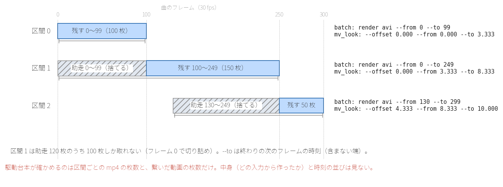
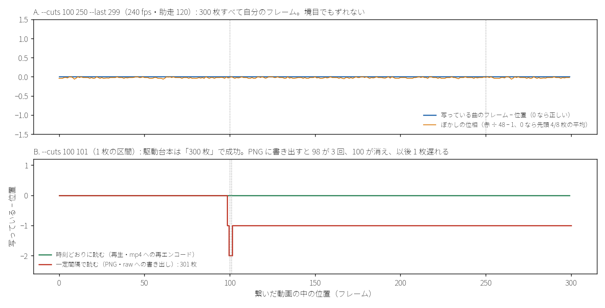

# 査読 10: `tools/mv_chunks.py`（枝 mv-chunks）マージ前の敵対的査読

- 日付: 2026-10-06
- 対象: 枝 `mv-chunks`（97993af。1145b60 の上に 1 コミット）の `tools/mv_chunks.py`（新規 261 行）・`tests/test_mv_chunks.py`（新規 26 本）・
  README の節「全曲を区間に分けて描いて繋ぐ」（403–425 行）。
- 比較した main: 依頼時 79ec6bb、査読中に ee1c5a2 へ進んだ（差は HANDOVER.md だけ）。`git merge-tree --write-tree main mv-chunks` は衝突なし。
- やり方: 枝と main には何も書いていない（終わりに mmd-cli の `git status --short` が 0 行、mv-chunks は 97993af、main は ee1c5a2 のまま。
  `git merge-tree --write-tree` は参照の無い木を .git に書くだけで、枝は動かない）。自分用の worktree（`review-mvchunks`、detached）で読み、
  終わりに `git worktree remove --force` で消した。試験・変異・直しの見本は `git archive` の写し（`r10/mut/`・`r10/fixproto/`）で走らせた
  （台本は消した worktree ではなく `r10/mut/` を指すので、そのまま流し直せる）。PowerShell は 5.1.26100 を
  `powershell -NoProfile -NonInteractive -File` で直接。MMD は起動していない。hinata には触れていない。
  「実地」と書いたものは、MMD だけを偽物（`r10/e2e/fake_mmd_cli_main.py`）に替え、道具が書いた駆動台本・python・本物の
  `tools/mv_look.py`・ffmpeg 8.1.2・ffprobe はすべて本物で走らせた結果。偽物はバッチを本物と同じに読み（utf-8-sig・JSON の行・行の順）、
  MMD が書くのと同じ枚数の BGRA 無圧縮 AVI（64x36）を ffmpeg で作る。各コマの色に「曲の何フレーム目か（G・B）」と
  「そのフレームの何番目のサブフレームか（R）」を書いてあるので、繋いだ動画を 1 コマずつ読み戻せば、どのコマがどこに入ったかが分かる
  （look は光・グロー・粒子を全部切って、人物の色がそのまま出るようにした）。

## 結論

- 判定: **マージは可。ただし `-Resume`（指摘 1）と引用（指摘 2）は、次に本番で使う前に直す。** 圧縮コーデックで 480 fps に進むなら 3 も。
  書き出す台本の中身は本番と同じで、フレームの計算は全部正しい（実地で 1 コマずつ確かめた。図 2 の A）。
- 重大度の数: 高 0 / 中 4 / 低 7 / 情報 3。
- 実装者の主張は、hinata の実機の件（走らせていない）を除いて全部再現した: 26 本 OK、全体 814 本 OK（8 本は飛ばし）、本番の計画と報告から作り直した 21 本のバッチは本番のものと
  parse 後に一致、畳みの引数・期待枚数（計 7,743）も一致、連結の一覧はバイト一致。実装者の 12 変異はすべて落ちる。
- 問題は「枚数しか見ない」所に集まっている: `-Resume` は枚数だけで済んだと判断するので古い入力の mp4 を黙って使い（1）、
  試験の偽物も枚数だけを作るので、歌詞が最初の区間にしか載らない壊し方も通す（4）。繋いだ動画の時刻の乱れも枚数では見えない（6）。

## 指摘

### 1. 中: `-Resume` は入力が変わった後でも古い mp4 を黙って使う（繋いだ動画が前回とバイト一致）

- 場所: `tools/mv_chunks.py:162`（`if ($Resume -and (Count-Frames $mp4) -eq $want)`）。済んだかどうかの印は mp4 の枚数だけで、
  枚数は区間の長さ（end − cut + 1）だけで決まる。モーション・カメラ・look・cues・fps・shutter・lead を変えても変わらない。
- 筋書き（実地 `e2e.py resume_stale`）: 3 区間を描く → 計画のモーションを `dance_v2.vmd` に替えて、同じ `--tag` で台本を書き直す →
  `render_t.ps1 -Resume` → 3 区間とも `skipped: … has its N frames`、`joined 300 frames (want 300)`、終了 0。繋いだ動画は 1 回目と
  バイト一致（v2 の印が出ない）。`-Resume` なしで流すと v2 になる。
- 起きやすい場面: 途中で止まる（容量・MMD の異常）→ 何かを直して台本を書き直す → `-Resume`。直したのが入力なら、止まる前の区間だけ
  古い版で後ろが新しい版の動画ができ、枚数の検査は全部通る。同じパスに作り直したモーション（台本は書き直さない）でも同じ。
  HANDOVER の「試写版 → 直した手ぶれ除去で描き直し」はまさに入力を直して描き直す流れで、今回は tag を変えたので起きていない。
  README は「同じ入力での描き直し専用」と書くが、道具は何も確かめない。
- 根拠: 実地（`r10/out/e2e_branch.txt` の resume_stale）。
- 直し方（`r10/fixproto/` で試した。リポジトリには入れていない）: 区間ごとの「レシピ」（バッチの本文と畳みの引数の SHA-256）を
  駆動台本に書き込み、成功した mp4 の隣に `<mp4>.recipe`（レシピ＋入力ファイルのパス・大きさ・更新時刻）を置く。`-Resume` は枚数と
  この印の両方が合うときだけ飛ばす。見本の結果: 何も変えずに `-Resume` → 3 区間とも飛ばす / モーションを替えて書き直し → 3 区間とも
  描き直す / look.json を同じパスのまま更新 → 描き直す。元の 26 本も通る。あわせて駆動台本にバッチの SHA-256 を持たせ、描画機に
  写したバッチが違えば止める（台本だけ写し直して古いバッチが残る事故を防ぐ）。
- 中の理由: 黙って成果物を間違えるが、入力を変えてから `-Resume` するという条件がいる。

### 2. 中: PowerShell が引用符とみなす全角の ’（U+2019）などがパスにあると、駆動台本が壊れる

- 場所: `tools/mv_chunks.py:128–129`（`_ps` は ASCII の `'` だけを `''` にする）。PowerShell 5.1 は単一引用符の文字列で
  U+0027 のほかに U+2018・U+2019・U+201A・U+201B も引用符として扱う（実測: `'Don` と `t'` の間に各文字を置くと 5 つとも構文エラー。
  全角の U+FF07 は平気）。
  U+2018/U+2019 は cp932 の ‘ ’（0x8165/0x8166）なので、MMD が開けるパス（`app._require_ansi` を通る）にもなる。
- 駆動台本に入る値: `mmd_cli`・`mmd_cli_home`・`out`・`look`・`cues`・`scripts`・`python`・`name`。バッチ（JSON）と連結の一覧
  （ffmpeg にとって ’ は普通の文字）は平気。
- 筋書き（実地）:
  - `out` に ’ → 台本と JSON は `ok: true`、駆動台本は構文エラーで 1 行も走らず終了 1。
  - `scripts` だけに ’・区間 1 つ → 引用が行をまたいで組み直されて構文が通ってしまい、
    `python -m mmd_cli --out "t/scripts/chunk_t_00.txt C:/…/t_00.json C:/…/t_00.avi …" batch "C:/…/Don"` という壊れた呼び出しが
    実際に走った（バッチが無いので止まった）。区間が 2 つだと構文エラー。何が起きるかは引用の数の偶奇で変わる。
- 根拠: 実地（`e2e.py quote2019 quote2019_scripts_only quote2019_scripts_one_chunk`）と `r10/e1/semantics.ps1` の 9。
- 直し方: `_ps` で 5 文字すべてを二重にする（`re.sub("['\u2018\u2019\u201a\u201b]", lambda m: m.group(0) * 2, s)`）。
  二重にすれば 1 文字に戻ることは構文解析で確かめた（`r10/e1/quotefix.ps1`）。見本では上の 2 つとも最後まで走り、全コマ正しい。
  試験に ’ を含むパスを 1 本足す。
- 中の理由: 日本語の環境で起こりうるパスで、台本が使えないか、壊れた引数でコマンドが走る。黙って間違えた絵は出ない。

### 3. 中: 空き容量の見積もりがコーデックを見ない（圧縮コーデックで 480 fps へ進めない）

- 場所: `tools/mv_chunks.py:78–80`（`avi_bytes` は常に BGRA 無圧縮の 4 バイト/画素）。計画の `codec`（100 行。任意に替えられる）を見ない。
  駆動台本はこの値＋2 GiB を空きと比べ、足りなければ終了 3（163–164 行）。
- 筋書き: HANDOVER（ee1c5a2）は 480 fps のために「alpha つきの可逆圧縮コーデック（UT Video など）を hinata に入れる」案を挙げている。
  本番の計画に `"codec": "UT Video"` を足して 480 fps で書くと、21 区間中 16 区間の必要量が 27 GB を超える（最大 36.2 GB）。
  空き 27 GB の hinata では、実際の AVI が何分の 1 でも、最初の該当区間（区間 2）で終了 3 になる。
- 根拠: 必要量は実測（本番の計画と報告で `avi_bytes` を呼んだ）。UT Video の実際の大きさは測っていない（推論）。
  未圧縮より大きくなるコーデックは無いはずなので、危ない側（容量不足のまま描く）には外れない（推論）。
- 直し方: 計画に `"avi_bytes_per_pixel"`（既定 4。`codec` が未圧縮でなければ必須）を足して見積もりに使い、要約の JSON に前提を出す。
  あるいは駆動台本の中で、最初の区間の AVI の実際の大きさ/枚数を測って、以後の区間の見積もりに使う。
- 中の理由: 次に予定している使い方（圧縮コーデック）で、描けるのに止まる。

### 4. 中: 試験が振る舞いを見ていない所がある（作った 17 の壊し方がすべて 26 本を通る）

- 場所: `tests/test_mv_chunks.py:132–162`（偽物の python・ffprobe・ffmpeg）、`:200–211`。
- いちばん強い例: `tools/mv_chunks.py:177` の `if plan["cues"]:` を `if plan["cues"] and c["index"] == 0:` にする → 歌詞が最初の区間にしか
  載らない（ヒビカセの 21 区間なら 20 区間で文字が消える）。枚数は同じなので駆動台本も成功する。26 本すべて通る（`r10/out/mutant_cues.txt`）。
  試験は `--cues` を区間 0 の畳みの行でしか確かめない（208 行）。
- ほかに生き残った 16（`r10/mutants.py`、`r10/out/mutants.txt`）: mv_look の終了コードを見ない / 連結（ffmpeg）の終了コードを見ない /
  mv_look に AVI の代わりに JSON を渡す / look の代わりに out を渡す / 連結の一覧の `'` を逃がさない / `-Resume` が枚数の多い mp4 も
  飛ばす / `-Resume` の判定を容量の検査の後にする / 余裕 2 GiB を 0 にする / python のパスを引用しない / MMD_CLI_HOME を設定しない /
  tag・fps ≤ 0・shutter ≤ 0・menu の状態・size の検査を外す / 最後のフレームちょうどのカットを拒む。
  前の 2 つ（終了コード）は、同じ名前の古い mp4 が残っていると、失敗した区間を古い mp4 で黙って埋める形になる。
  対照: 実装者の 12 変異と、自分で入れた「助走を 0 で切らない」は同じ仕掛けで落ちる。
- 偽物と本物の食い違い（実地で確かめた）:
  - 偽物は PowerShell の関数なので、外部コマンドへの引数の渡し方（PS 5.1 の古い方式）を通らない。`look` が空文字の計画は、
    偽物の試験では終了 0、本物では空の引数が落ちて `mv_look.py render: error: the following arguments are required: out`
    で止まる（MMD で描いた後）。
  - 偽物の mv_look は AVI も look も読まず、枚数を `(--to − --from) × 30` で作るだけ。`--offset` の誤り（区間 2 の 1 行だけは文字列で
    確かめている）や AVI と mp4 の取り違えは見えない。
  - 偽物の ffprobe はファイルに書いた数を返すだけなので、繋いだ動画の時刻の乱れ（指摘 6）は見えない。
  - 試験の包み（`& 'render_t.ps1'` の後に `exit $LASTEXITCODE`）は本物の `-File` と違う形だが、`exit` の伝わり方は同じだった
    （`-File` で関数の中の `exit 7` は終了 7、普通に終われば前の外部コマンドが 9 でも終了 0。`r10/out/semantics.txt` の 1）。
- 根拠: 実地（変異は写し `r10/mut/` で 1 つずつ書き換えて 26 本を走らせた）。
- 直し方: (1) 偽物の mv_look に「AVI がある・look が JSON として読める・`--offset ≤ --from`」を確かめさせ、全区間の畳みの行（`--cues`
  を含む）を表で比べる。(2) 失敗の注入を 2 つ足す（mv_look の失敗で、同じ名前の古い mp4 が残っていても止まる / 連結の失敗で止まる）。
  (3) 本物の python・ffmpeg・ffprobe と小さい合成 AVI で回す試験を 1 本足す（この査読の `e2e.py` は 64x36・300 枚で 1 件 5〜15 秒）。
  (4) 入力の検査の分岐ごとに 1 本。
- 中の理由: 今のコードは正しいが、上の壊し方が入ったとき試験は黙る。うち 3 つ（歌詞・2 つの終了コード）は成果物を黙って間違える。

### 5. 低: shutter と fps の検査が mv_look・MMD と食い違い、最初の区間を描いた後で止まる

- 場所: `tools/mv_chunks.py:199–202`。
- 筋書き（実測 `r10/out/probe_inputs.txt`）: `--fps 60 --shutter 0.2`・`--fps 240 --shutter 0.05` は `ok: true` だが、
  `mv_look.check_shutter` は「takes no subframe」で拒む。駆動台本は区間 0 の MMD 描画を終えてから mv_look で止まる（終了 1。
  この流れは空の look の実地と同じ）。`--fps 90`・`960` も通る（誤りの文言は「30, 60, 120, 240, 480」と言うのに）。
  MMD が書けない fps なら、`render avi` の枚数の検査で区間 0 が止まる（推論）。
- 直し方: fps を `(30, 60, 120, 240, 480)` に絞り、shutter は mv_look と同じ式 `floor(shutter × sub + 0.5) ≥ 1` で確かめる（見本で実装）。

### 6. 低: 1〜2 枚の区間があると、繋いだ動画の時刻が乱れる（駆動台本は成功と言う）

- 場所: `tools/mv_chunks.py:45–68`（区間の長さに下限が無い）、`:186–189`（繋いだ動画は枚数だけを見る）。
- 筋書き（実地 `e2e.py one_frame short2 short3`）: `--cuts 100 101 --last 299` → 区間 1 は 1 枚。区間ごとの枚数も繋いだ動画の枚数（300）も
  合い、終了 0。ところが `-c copy` の連結で次の区間の先頭の DTS が前より小さくなり、ffmpeg が少しずつずらして詰める（長さ 0.000065 秒の
  パケットが 2 つ）。時刻どおりに読む再生と mp4 への再エンコードでは 300 枚とも正しいが、PNG に書き出すと 301 枚になり、98 が 3 回・
  100 が無く、以後 1 枚ずつ遅れる（図 2 の B）。2 枚の区間でも同じ、3 枚なら起きない。
- 実害の範囲: make_camera の最短ショットは 180 枚なので `--shots` では起きない。`--cuts` を手で打つとき（480 fps のための途中の区切りなど）だけ。
- 根拠: 実地。
- 直し方: 3 枚未満の区間を誤りにする（見本で実装）。

### 7. 低: 入力の検査の穴（型・空・作為的な値）

- 場所: `tools/mv_chunks.py:45–57`・`:83–105`・`:203`・`:253`。
- 実測（`r10/probe_inputs.py`、出力 `r10/out/probe_inputs.txt`）:

  | 入力 | 結果 |
  | --- | --- |
  | `size: "12"`・`[1280, "720"]`、`menu: [...]`・`null`、報告が配列、`end: "99"` | traceback で終了 1（説明文 31 行の「誤りは JSON・終了 2」に反する） |
  | `size: [1280.5, 720]`・`[true, 720]`、`accessories` が文字列 1 本、`motions: [null]`、`look: ""` | `ok: true`。hinata で失敗する（accessories は 1 文字ずつ `accessory load C` …、look は空の引数が落ちて mv_look が止まる＝実地） |
  | `menu: {"0282": "off"}` | `ok: true`。282 の検査は文字列 "282" だけを見るので通り、mmd は `menu set 0282 off` を 282 として読む（確かめた）→ 背景黒化が切れて alpha の無い AVI。枚数の検査は通る |
  | 報告に `shots` が無い / `start`・`end` が文字列 | 誤りの文言が `'shots'` だけ / 「最初のショットは 0 から」と誤った理由で拒む |
  | `--tag "final\n"` | 正規表現の `$` が末尾の改行の前で合うので通り、ファイル作成の OSError で止まる |
  | `--shots … --last 50` | `--last` は黙って無視 |
  | `out: "out"`（相対） | 通る。描画は中継先（デスクトップのセッション）の作業フォルダ、連結の一覧は一覧のフォルダが基準になり、場所が食い違う（推論） |

- 直し方: 型（文字列・正の整数・文字列のリスト）を確かめ、menu の id は `int` にしてから 282 を見る。`main` で TypeError・AttributeError も
  JSON にする。パスは絶対パスに限る。`re.fullmatch`。

### 8. 低: UNC の out では必ず「容量不足」で止まり、ジャンクションの先では別のボリュームを測る

- 場所: `tools/mv_chunks.py:163–164`（`(Get-Item -LiteralPath $out).PSDrive.Free`）。
- 筋書き（実地 `e2e.py unc`）: `out` を `//localhost/C$/…` にすると `PSDrive` が null、`$null -lt 2154856448` が True で
  `t_00 STOP:  bytes free, …`（数が空欄）・終了 3。ジャンクションやマウントしたフォルダでは PSDrive はリンクのあるドライブになり、
  実際に書く先の空きではない（この PC は C: だけなので推論）。
- 直し方: `GetDiskFreeSpaceEx`（フォルダのパスを受け、UNC・マウントポイントも正しい）を Add-Type で呼ぶ。見本で実装し、UNC で最後まで走った。

### 9. 低: 区間に分けると、光のループが各カットで頭に戻り、カット直前のフレアのパンチが二度鳴る（mv_look 側）

- 場所: `tools/mv_look.py:268–269`（光の連番は `-stream_loop -1` だけで、区間の頭で必ず 0 番から）、`:322–336`（区間の前から続く
  フレアは offset 0 になり、パンチと色ずれが区間の頭で最大から始まる）。どちらもこの枝の差分の外だが、区間に分けたことで表に出る。
- 筋書き（実物、図 3）: 最終版（区間に分けて描いた）のフレーム 255 は、光の層の位相 255 と相関 0.94。カット直後の 256 は位相 0 と 0.83
  （位相 256 とは 0.74）。全曲を 1 本で描いた 10/5 版は 256 でも位相 256 と 0.94。光の層は 255 → 256 で背景の平均 3.31/255 動く
  （続けて描けば 0.07）。光条の揺れ（±3 度）と玉ボケの漂いの位相が、20 か所のカットで頭に戻っている。カットと同時なので目立たない
  可能性が高いが、「境目はカットに隠れる」は物理については正しく、光の層では区間の数だけ継ぎ目が増えている。
- パンチ: カットの 5 フレーム前のフレアで argv を作ると、次の区間の頭で `0.04*pow(max(0,1-(t-0.000)/0.333),2)`（減衰の途中ではなく
  最大）と `between(t,0.000,0.333)` になる。ヒビカセのフレア 5 つは、どれもカットの前 12 フレーム以内に無いので、最終版には出ていない
  （確かめた）。
- 根拠: 光は実物で測った。パンチは argv で確かめた（描いてはいない）。
- 直し方: mv_look で光の連番の入力に区間の位相（`clip_start mod loop_seconds`）から始める seek を付ける。パンチと色ずれは、
  区間の前に始まったフレアなら負の時刻のまま式に入れて、減衰の途中から始める。

### 10. 低: 失敗の理由が残らない

- 場所: `tools/mv_chunks.py:167–168`。mv_look の標準出力（誤りの JSON）を `Out-Null` で捨てるので、`mv_look failed (exit 2)` の理由は
  描画機で手で流し直さないと分からない（argparse の使い方の表示は標準エラーなので見える）。
- あわせて: コマンドが見つからないと `$LASTEXITCODE` は前の値のまま（実測: 3 のまま）。最初の区間では `$null` なので止まるが、
  `-Resume` で前の区間の ffprobe が 0 を残した後だと、バッチの検査を素通りする（最後は枚数の検査で止まる）。
- 根拠: 実測（`r10/out/semantics.txt` の 2、`r10/out/semantics_more.txt` の 10）。
- 直し方: mv_look の標準出力を `<mp4>.look.json` に書き、失敗したら表示する（見本で実装）。外部コマンドの前に `$global:LASTEXITCODE = $null`
  を置く。`global:` を付けないと関数の中に同じ名前の変数ができ、外部コマンドの終了コードが読めなくなる（実測: 読めるのは空、本物は 4）。

### 11. 低: 記述の食い違い

- 説明文 7 行「全曲で ~250 GB」→ 実際は 7,743 × 8 × 1280 × 720 × 4 = 228 GB（README の mv_look の節は 228 GB、新しい節は「200 GB を超える」）。
- README 415 行は `accessories` `cues` を必須の側に並べるが、コードでは任意（`setdefault`）。説明文の optional の一覧にも無い。
- 説明文 31 行「誤りは JSON・終了 2」は型の誤りで成り立たない（7）。
- README 421 行「どこかで失敗すると止まり」: `Remove-Item` の失敗（AVI が掴まれている等）は止まらず続く（`$ErrorActionPreference = 'Continue'`）。
- README に足すとよいこと: パスは絶対パス、UNC は不可（8 を直さない場合）、`--shots` の報告は描くカメラと同じ make_camera の実行のもの、
  `-Resume` は入力を変えたら使わない（1 を直さない場合）。

### 12. 情報

- 本番の計画のカメラは `camera_D_handheld.vmd`、使った報告の `out` は `camera_D_generated.vmd`。make_camera の `--handheld` はショットを変えない
  （`plan_shots` が先に決まる）ので結果は正しいが、道具は報告とカメラの対応も、報告の `frames`（[0, 7742]）も確かめない。
- mmd_cli は失敗した描画を `<avi>.mmdcli-failed` として残す（最大で区間の AVI と同じ 17 GB）。駆動台本は消さないので、失敗をくり返すと容量の検査で止まる。
- 仮説を 1 つ実測で否定した: mv_look は `-ss` を小数 3 桁で書くので、`(cut − first)/30` が切り上がる区間（例: 助走が 0 で切れて cut = 101）で
  先頭のサブフレームが 1 つ落ちて、ぼかしの位相が 1/240 秒ずれると予想した。実地（`clamp2`・`clamp2_fps30`・`lead50_fps60`）では落ちない
  （ffmpeg は入力の時刻の単位 1/240 に丸めて切る）。

## 確かめて問題がなかったこと

### 1. 実装者の主張の再現

| 主張 | 結果 |
| --- | --- |
| 26 本 OK | 26 本 OK（12.1 秒） |
| 全体 814 本 OK | 814 本 OK・8 本飛ばし（60.2 秒、写し `r10/mut/`） |
| 本番の旧スクリプトと一致 | 枝の道具で `plan_hibikase_final.json` と `camera_D_report.json` から作り直すと、21 本のバッチは本番の `chunk_final_NN.txt` と parse 後に一致、畳みの引数 21 組・期待枚数（計 7,743）も一致、連結の一覧はバイト一致 |
| 12 変異をすべて落とす | 写しで 12 本とも落ちた（`r10/out/their_mutants.txt`） |
| hinata の 2 区間 | 走らせていない（hinata に触れない決まり）。`_spike/.../mvchunks_live/` の台本 2 本は主張どおり（改行を除くと 31 行目の期待枚数 30 と 31 の違いだけ） |

### 2. PowerShell 5.1 の意味論（`r10/e1/semantics.ps1`、出力 `r10/out/semantics.txt`）

| 項目 | 結果 |
| --- | --- |
| 関数の中の `exit` | `-File` で終了コード 7、後ろの行は走らない |
| `-File` の普通の終わり | 前の外部コマンドが 9 でも終了 0 |
| `\| Out-Null` の後の `$LASTEXITCODE` | `cmd /c exit 5` → 5、python の `sys.exit(3)` → 3 |
| `@fold` の外部コマンドへの展開 | 空白・全角（ヒビカセ・全角空白）・`'`・`{0}`・`$x`・`;&()` は python の argv にそのまま届く。空文字は落ち、空白を含み `\` で終わる要素は次の要素とくっつき、`"` は消える（道具の値で起こりうるのは空文字だけ） |
| `-f` | パスはすべて引数で渡しているので、パスの `{0}` はそのまま出る（実地の特殊文字の件でも確認） |
| 外部コマンドの標準エラー（Continue） | そのまま表に出て台本は続く。`$n = & …` には標準出力だけが入る |
| `Count-Frames` | 本物の ffprobe で: 完全な mp4 → 300、moov の前で切れた mp4（途中で殺された ffmpeg）→ -1、データの途中で切れた mp4 → 120（足りないので描き直しになる）、無い → -1（`r10/out/semantics_more.txt` の 11） |
| `New-Item -Path` に `[1]` | 文字どおりのフォルダができる |

### 3. フレームの計算（実地、図 2 の A。出力 `r10/out/e2e_branch.txt`）

各ケースで、繋いだ動画の全コマについて「写っている曲のフレーム」と「ぼかしの位相（先頭 round(S×N) 枚の平均か）」を読み戻した。

| ケース | 区間（first, cut, end） | 結果 |
| --- | --- | --- |
| 基本: `--cuts 100 250 --last 299`、240 fps、助走 120 | (0,0,99) (0,100,249) (130,250,299) | 300 枚すべて自分のフレーム、位相も全区間で先頭 4/8 |
| 助走が 0 で切れ、cut/30 が 3 桁で切り上がる（`--cuts 101 250`） | (0,0,100) (0,101,249) (130,250,299) | 同上（240 fps・30 fps とも） |
| `--lead 0` | (0,0,99) (100,100,249) (250,250,299) | 同上 |
| `--fps 60 --lead 50`（(cut − first)/30 = 1.667 に切り上がる） | (0,0,99) (50,100,249) (200,250,299) | 同上（位相は 2 枚の先頭 1 枚） |
| `--fps 480` | 基本と同じ | 同上（先頭 8/16） |
| 1 枚の区間（`--cuts 100 101`） | (0,0,99) (0,100,100) (0,101,299) | 時刻どおりに読めば 300 枚とも正しい（一定間隔で読むと指摘 6） |

- `--to` は終わりの次のフレームの時刻（含まない端）、`--offset` は AVI の先頭のフレーム（助走込み）の曲の時刻。図 1。
- AVI の見積もり `(end − first + 1) × (fps/30) × w × h × 4` は `app.expected_avi_frames` × 画素 × 4 と同じ（fps が 30 の倍数のとき）。
  HANDOVER の実測（240 fps・420 フレームで 12.4 GB）とも合う。最大の区間は 17.0 GB。

### 4. 書き出し

- 連結の一覧の `'` の逃がし方（`'\''`）は ffmpeg の規則どおりで、本物の ffmpeg で `it's` を含むフォルダを繋げた（実地の特殊文字の件。
  フォルダ名は `sp ace ヒビカセ　全角 it's {0} $x;&(1)[1]`、全コマ正しい）。
- バッチは UTF-8（BOM なし・LF）で、mmd_cli は utf-8-sig で読む。駆動台本は BOM つき・CRLF。
- OUTDIR に別の tag や、区間の多かった前回の台本が残っていても、駆動台本と一覧は自分の tag の区間しか指さない。
- `git merge-tree`: main（ee1c5a2）と衝突なし。

### 5. 入力の検査で正しく拒むもの

- 計画: `motions` が文字列 1 本・空、menu 282 を off、menu の id が数字でない・状態が on/off でない、`size` が 2 つでない・0 以下、必須の欠け（名前を並べる）。
- `--cuts`: 重複・逆順・0 を含む・最後のフレームより後。最後のフレームちょうどのカットは 1 枚の最後の区間として通る（最後の区間なら指摘 6 は起きない）。
- 報告: ショットの抜け・重なり、最初が 0 でない、終わりが始まりより前。並びが乱れていても並べ直す。
- `--fps` が 30 の倍数でない・0・負、`--shutter` が 0・負・1 超・nan、`--tag` に空白・空文字、`--lead` が負。

## 直しの見本（`r10/fixproto/tools/mv_chunks.py`、差分 `r10/fixproto.diff`。リポジトリには入れていない）

1・2・5・6・8・10 を入れた（+73 −26 行）: `_ps` で 5 つの引用符を二重に / レシピと入力の印で `-Resume` / バッチの SHA-256 の照合 /
`GetDiskFreeSpaceEx` / fps を 5 つに絞り shutter を mv_look と同じ式で / 3 枚未満の区間を拒む / `re.fullmatch` / mv_look の標準出力を残す。
元の 26 本は全部通る。実地（`r10/out/e2e_fixproto.txt`）: 基本・特殊文字・’ を含む out・’ を含む scripts（区間 1 つ）・UNC の out が最後まで走って
全コマ正しい、入力を替えた後の `-Resume` は全区間を描き直す、何も変えない `-Resume` は全区間を飛ばす、look.json を同じパスで更新すると
描き直す、1 枚の区間は書く前に拒む。見本は全体の査読をしていない（型の検査 7・コーデック 3・試験 4 は入れていない）。

## 確かめられなかったこと

- MMD と hinata（決まりで触れない）: 本物の AVI、中継、hinata の SSH の下での `PSDrive.Free`、UT Video の大きさと alpha。
- ジャンクション・マウントポイントの先の空き（この PC は C: だけ）。
- 光のループの継ぎ目（指摘 9）が見る人に気づかれるか。
- 試験はすべて写し（`r10/mut/`・`r10/fixproto/`）で `python -B` で走らせた。写しは worktree と同じ中身（tools・tests・mmd_cli を比べて差なし）。

## 図

図 1（図示）: 1 区間で描く・残す・確かめる範囲。`--cuts 100 250 --last 299 --lead 120` の 3 区間と、バッチ・mv_look に渡る数。

図 2（実物）: 実地で繋いだ動画を 1 コマずつ読み戻した結果。A は基本のケース（300 枚とも自分のフレーム、ぼかしの位相もずれない）。
B は 1 枚の区間を含むケースで、駆動台本は成功と言うが、一定間隔で読むと 98 が 3 回・100 が消え、以後 1 枚遅れる。

図 3（実物に図示）: ヒビカセの最終版（区間に分けて描いた）と 10/5 版（全曲を 1 本で描いた）の最初のカット（255 | 256）。
橙の破線の枠で、絵と mv_look の光の層の相関を取った。最終版だけ、カット直後の光が位相 0 に戻っている。右は光の層そのものの変化。

（図 3 は MV の絵を含むので公開リポジトリには入れない。手元の `_spike/out/report/review10_fig3_light_reset.png`）

## 台本と出力（すべて `scratchpad/r10/`）

| 台本 | 中身 | 出力 |
| --- | --- | --- |
| `e1/semantics.ps1` / `e1/more.ps1` / `e1/quotefix.ps1` | PowerShell 5.1 の意味論 9 項目 / `$LASTEXITCODE` の有効範囲と壊れた mp4 の数え方 / 引用符を二重にしたときの値 | `out/semantics.txt` / `out/semantics_more.txt` / `out/quotefix.txt` |
| `e2e/run_all.py`（`e2e/e2e.py`・`e2e/fake_mmd_cli_main.py`） | 実地（MMD だけ偽物）。枝の道具 16 件と見本 7 件＋`-Resume` の 2 件 | `out/e2e_branch.txt` / `out/e2e_fixproto.txt`、動画は `e2e/cases/`（見本は `e2e/cases_fix/`） |
| `probe_inputs.py` | 入力の検査（型・空・作為的な値・fps と shutter） | `out/probe_inputs.txt` |
| `mutants.py` / `their_mutants.py` | 自分の 16 変異（＋歌詞の 1 つ） / 実装者の 12 変異 | `out/mutants.txt`・`out/mutant_cues.txt` / `out/their_mutants.txt` |
| `patch_fixproto.py` | 直しの見本を写しに当てる | `fixproto/`・`fixproto.diff` |
| `make_figs.py` | 図 1〜3（図 3 は `light/` に最終版と 10/5 版の 253〜258 を抜いた） | `figs/` |

## 査読 10 への直し（実装者、2026-10-06、枝 mv-chunks の e6475e4）

| 指摘 | 直し | 確かめ方 |
| --- | --- | --- |
| 1 中 `-Resume` が古い入力の mp4 を使う | 区間ごとの作り方の印（バッチ・look・畳みの引数の SHA-256）と入力ファイル（モデル・モーション・カメラ・アクセサリ・look・cues・mv_look 自身）の大きさと更新時刻を `<mp4>.recipe` に書き、枚数と印の両方が合う区間だけ飛ばす。駆動台本はバッチの SHA-256 を持ち、描く直前に違えば止まる | 偽物の試験 5 本（入力の変更・その場の書き換え・バッチだけの変更・枚数の多い mp4・容量の前に判定）、本物の mv_look と ffmpeg の試験（動きを替えて `-Resume` → 全コマ新しい動き）、hinata の本物の MMD で 2 区間（何も変えない `-Resume` は飛ばす、look を書き換えると描き直す、バッチを改変すると区間 1 で止まる） |
| 2 中 全角の ’ などで台本が壊れる | `_ps` で 5 文字すべてを二重に | ’ と ‘ を含む out と scripts で駆動台本が最後まで走る試験、`_ps` の単体試験 |
| 3 中 容量の見積もりがコーデックを見ない | 計画に `avi_bytes_per_pixel`（未圧縮なら 4。ほかのコーデックでは必須） | 単体試験、要約の JSON に出す |
| 4 中 試験が振る舞いを見ない | 偽物の mv_look が AVI・look・`--offset ≤ --from` を確かめる、全区間の畳みの引数を表で比べる、mv_look と結合の失敗を注入（古い mp4 があっても止まる）、偽の MMD（フレーム番号を色で書く）と本物の mv_look・ffmpeg で 1 コマずつ読み戻す試験 2 本 | 変異 40（査読の生き残り 17・前の 12・新しい部分 11）のうち 39 を落とす。残る 1 つ（描く前に古い mp4 を消さない）は、印の照合で古い mp4 が使われなくなったので振る舞いが変わらない |
| 5 低 shutter と fps | fps は 30/60/120/240/480、シャッターは mv_look と同じ式 | mv_look の `check_shutter` と格子で一致する試験 |
| 6 低 1〜2 枚の区間 | 3 枚未満を拒む | 単体試験 |
| 7 低 入力の型 | 型・絶対パス・知らない項目・menu の id（0282 は 282）・name を検査、`--shots` と `--last` の併用を拒む、型の誤りも JSON・終了 2、`re.fullmatch` | 単体・CLI の試験 |
| 8 低 UNC で必ず容量不足 | GetDiskFreeSpaceEx（Add-Type） | UNC の out で最後まで走る試験 |
| 9 低 光のループとパンチが区間の頭で戻る | mv_look: `--from` の曲の時刻から光のループの位相を取り（同じ連番を 2 つの入力にして concat）、区間より前に始まったフレアのパンチと色ずれは負の時刻で途中から。全曲を 1 本で描く引数は変わらない | 光の各コマを灰色の段で作った本物の描画で、区間の頭がループの位相 3 から続く試験、パンチの式の試験 |
| 10 低 失敗の理由が残らない | mv_look の答えを `<mp4>.look.json` に書き、失敗したら表示。外部コマンドの前に `$global:LASTEXITCODE = $null` | 失敗の注入で理由（stub failure）が出る試験 |
| 11 低 記述 | 説明文と README を直した（228 GB、必須と任意、`-Resume` の条件、UNC 可） | ― |
| 12 情報 報告とカメラの対応 | README に「描くカメラと同じショットの報告」と書いた（道具は確かめない） | ― |
| 13 情報 `.mmdcli-failed` が残る | 区間を描く前に、その区間の AVI と `.mmdcli-failed*` を消す | 試験 1 本 |

- 全体の試験 849 本 OK（1 本は以前からの飛ばし）。ヒビカセの最終の計画で作り直した 21 本のバッチ・畳みの引数・連結の一覧は本番と一致。
- 実地の注意: 改変したバッチの検査は「描く直前」に効く。`-Resume` で飛ばす区間は、駆動台本の印どおりに作られた mp4 なので、
  バッチのファイルが後から変わっていても描き直さない（そのバッチは使っていない）。
