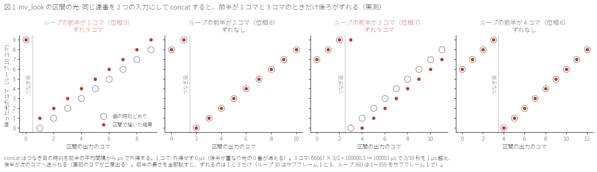
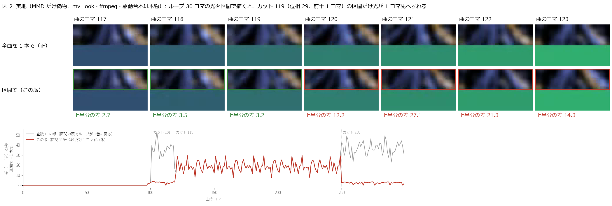
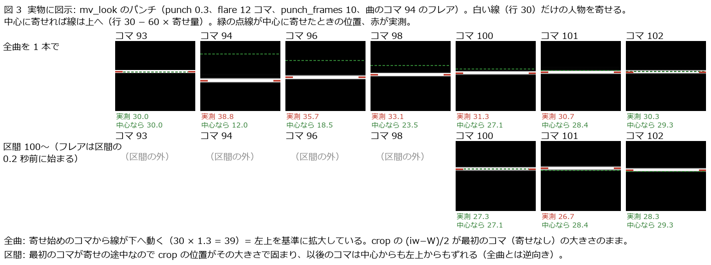

# 査読 11: 査読 10 への直し（枝 mv-chunks の e6475e4・3b5b203）の再査読

- 日付: 2026-10-06
- 対象: `git diff 97993af 3b5b203`。`tools/mv_chunks.py`（ほぼ書き直し、392 行）・`tests/test_mv_chunks.py`（26 → 56 本）・
  `tools/mv_look.py`（区間の光の位相とフレアのパンチ）・`tests/test_mv_look.py`（5 本追加）・README 2 か所・
  `docs/reviews/2026-10-06-review-10-mv-chunks.md`（末尾の直しの表）。
- 比較した main: 依頼時 3dccc81、査読中に 74f8df0 へ進んだ（HANDOVER.md だけ）。`git merge-tree --write-tree main mv-chunks` は衝突なし。
- やり方: 枝と main には何も書いていない（mv-chunks は 3b5b203 のまま）。自分用の worktree（`scratchpad/review11`、3b5b203 の detached）で
  読んで試験を走らせ、終わりに `git worktree remove --force` で消した。変異・直しの見本・新旧の比べは `git archive` の写し
  （`r11/mut`・`r11/fix`・`r11/new` = 3b5b203・`r11/old` = 97993af）で走らせた。PowerShell は 5.1.26100.9444（ja-JP、出力 cp932）を
  `powershell -NoProfile -NonInteractive -File` で直接（Python から呼ぶときは CREATE_NO_WINDOW）。MMD は起動していない。hinata には触れていない。
- 「実地」は査読 10 と同じく、MMD だけを偽物（`r11/e2e/fake_mmd_cli_main.py`）に替え、道具が書いた駆動台本・python・本物の
  `tools/mv_look.py`・ffmpeg 8.1.2・ffprobe は本物で走らせた結果。偽物は査読 10 のもの（各コマの色が曲のコマとサブフレームを表す）に、
  モデルの隣の `tex.txt` をテクスチャの代わりに読むこと（MMD がモデルを読むときにテクスチャも読むのと同じ形）と、`MARK` の 1 行で
  mmd_cli 本体の変更を表すことを足した。

## 結論

- 判定: **マージは可。ただし指摘 1（-Resume の印に入らない入力）と指摘 2（作業フォルダに残る前の look の光とフレア）は、
  次に本番で入力や look を直して描き直す前に直す。** 1 は README と説明文の一文を直すだけでも足りる。3（試験の穴）は直しの効き目を
  守るために早めに。4 は main にある以前からの問題で、このマージを止める理由ではない。
- 重さの数: 高 0 / 中 4 / 低 5 / 情報 6。
- 査読 10 の 13 項目のうち 11 は直った（査読 10 の再現の手順を新しい道具に当て直した。表は後ろ）。4（試験）と 9（光とパンチ）は一部。
- 実装者の主張は、hinata の実機の件（走らせていない）を除いて再現した: 56 本 OK、全体 849 本 OK（この木では 8 本飛ばし。7 本は
  `_spike` の実データが要る試験）、ヒビカセの最終の計画で作り直した 21 本のバッチ（parse 後）・畳みの引数 21 組・期待枚数（計 7,743）が
  本番の台本と一致し、連結の一覧はバイト一致。変異 40 は写しで流し直して 39 が落ちた（残る 1 つは実装者の言うとおり「描く前に古い mp4 を
  消さない」）。
- 新しい問題は 3 つの型に分かれる。(a) 印・試験・説明が「どこまで見ているか」の言い過ぎ（1・3・7・9）、(b) mv_look の層の作り方が
  区間と描き直しに追いついていない（2・5・6）、(c) main からある mv_look のパンチの切り出し位置（4）。

## 指摘

### 1. 中: `-Resume` の印は 8 種のファイルしか見ず、テクスチャ・フォント・mmd_cli・MMD 本体を直しても古い mp4 を黙って使う

- 場所: `tools/mv_chunks.py:228–230`（`inputs`）・`:256–257`（`$stamp`）。README 430–431 行「入力を直した区間は描き直しになる」、説明文 33–34 行。
- 印に入るもの: モデル（pmx）・モーション・カメラ・アクセサリ（.x）・look・cues・`tools/mv_look.py`・`tools/mv_text.py` の大きさと
  更新時刻、それにバッチの本文・look のパス・畳みの引数の SHA-256。
- 入らないが絵を変えるもの: pmx が指すテクスチャ・トゥーン・スフィア（MMD はモデルを読むときに読む）、.x が指すテクスチャ、
  mv_text が描画機で探すフォント（Y1 の欧文と日本語。入れると置き換えが変わる）、mmd_cli 本体（`mmd_cli/*.py`）、MikuMikuDance.exe とその設定。
- 筋書き（実地 `e2e11.py resume_inputs`）: モデルを実在のファイルにし、隣の `tex.txt` を偽の MMD がテクスチャとして読む。全区間を描く →
  `tex.txt` を書き換える → `-Resume` → 3 区間とも skipped、繋いだ動画の 300 コマのどれにも新しいテクスチャが出ない。`-Resume` なしなら
  300 コマすべて新しい。`mmd_cli/__main__.py` の 1 行を変えた場合（`MARK = "B"`）も 3 区間とも skipped で古いまま。
  対照: `tools/mv_look.py` の時刻だけを更新すると全区間を描き直す（印そのものは効いている）。
- 根拠: 実地（`r11/out_resume.txt`）。MMD が本当にテクスチャをモデルの読み込みで読むことは推論（pmx の仕様）。
- 直し方: どちらか。(a) README と説明文を「印はこの 8 種のファイルの大きさと時刻だけ。モデルやアクセサリが読む別のファイル（テクスチャ等）・
  フォント・mmd_cli・MMD を直したら -Resume を使わない」に直す。(b) モデルとアクセサリのフォルダの中身（`Get-ChildItem -Recurse -File -Force`
  の大きさと時刻）、`mmd_cli/*.py`、`mmd` の exe を `$stamp` に足す（stat だけなので数百ファイルでも 1 秒かからない）。
- 中の理由: 査読 10 の指摘 1 と同じ「黙って古い区間が混ざる」型で、条件（印の外のファイルを直してから -Resume）はそれより狭い。

### 2. 中: mv_look は作業フォルダの古い光とフレアの連番を消さず、look を直して描き直すと前の look のループとフレアが混ざる（差分の外。この枝の流れで起きる）

- 場所: `tools/mv_look.py:210–227`（`write_layers` は書く前に古い番号を消さない）、`tools/mv_chunks.py:210`（全区間・全実行で同じ
  `--work OUT/look_work_<tag>`、97993af から）。mv_text の `render_cue`（`tools/mv_text.py:935–950`）は同じ理由で古い番号を先に消している
  （「ffmpeg reads a sequence until a number is missing, so one more file would make the cue longer」）。
- 筋書き（実測 `r11/look/stale.py`、本物の mv_look の CLI に同じ `--work` を渡す）:
  - `beams.loop_seconds` 2 で描いた後に 1 で描くと、作業フォルダの光は 60 枚のまま（新しい 30 枚と前の 30 枚）。出力はコマ k と k+30 の差が
    23.79（新しいフォルダなら 1.73）、k と k+60 の差が 1.51 で、60 コマのループのまま。
  - `flare.frames` 12 の後に 4 にすると、フレアは 11 コマ光る（新しいフォルダなら 4 コマ）。
  - 光の無い look（beams・bokeh 0、ループ 1 秒）に変えると、ループの後半 30 コマだけ前の光が出た（同じ台本の最初の版で偶然起きた）。
- 区間で起きること: 印（指摘 1）は look の変更を見て全区間を描き直すが、描き直しが古い層を使う。区間の位相は新しい枚数（`light_frames`）で
  取るので、実際のループ（前の枚数）とも合わず、カットでも区間の途中でも光が跳ぶ（推論）。本番の `render_final.ps1` も
  `--work C:/work/hibikase/out/look_work_final`（全区間で共有）なので同じ配置。
- 根拠: 実測（`r11/out_stale.txt`）。
- 直し方: `write_layers` で、書く前に `light/` の `light_*.png` と `flare/` の `flare_*.png` を消す（mv_text と同じ）。見本 `r11/fix` に入れ、
  ループ 1 秒に戻すと 30 枚・k と k+30 の差 1.73、フレア 4 コマに戻ることを確かめた（`r11/out_stale_fix.txt`）。
- 中の理由: 条件（ループかフレアを短くして同じ tag で描き直す）は、直しが勧める「look を直して -Resume」の流れそのもの。絵は黙って違う。

### 3. 中: 試験が新しい仕組みの多くを押さえていない（新しく作った 16 の壊し方のうち 12 が通る）

- 場所: `tests/test_mv_chunks.py`（DriverTest の入力は look のほかは描画機のパスのままで存在しない、:564 の FLAT_LOOK は光もパンチも無し）、
  `tests/test_mv_look.py:493–537`（区間の光は位相 3 の 1 通りで、`ffmpeg_command` を直接呼ぶ）。
- 変異（`r11/mut11.py`、写し `r11/mut` で 1 つずつ。実装者の 40 と重ならないものだけ）:

  | 壊し方 | 結果 |
  | --- | --- |
  | 印に look だけを入れる（モデル・モーション・カメラ・アクセサリ・cues・mv_look・mv_text を外す） | 通る |
  | 印から mv_look.py・mv_text.py を外す | 通る |
  | 印から cues を外す | 通る |
  | 印から更新時刻を外す（大きさだけ） | 通る |
  | 印から大きさを外す（時刻だけ） | 通る |
  | 作り方の印から畳みの引数を外す（shutter だけ変えても描き直さない） | 通る |
  | `.mmdcli-failed*` の `*` を外す（`.mmdcli-failed.1` が残る） | 通る |
  | 飛ばす区間の AVI を消さない | 通る |
  | `.recipe` を Trim せずに比べる | 落ちる |
  | バッチ・mv_look・連結の前の `$global:LASTEXITCODE = $null` を外す（3 つ別々） | 3 つとも通る |
  | `mv_look.render` が `light_frames` を渡さない | 通る |
  | 位相を `--offset` から取る / 位相を 1 コマ遅らせる / 前のフレアのパンチを頭から全部（古い式） | 3 つとも落ちる |

- いちばん重いのは `light_frames` の生き残り: mv_chunks が実際に使う `mv_look.py render` の経路で、査読 10 の 9 の直し（光の位相）が丸ごと
  消えても全試験が通る（位相の試験は `ffmpeg_command` を直接呼び、実地の試験は光の無い FLAT_LOOK）。次は印: 試験で中身を変える入力は
  look だけで、ほかの 7 種と「大きさが同じで中身だけ変わる」場合（smooth_motion の作り直しはキーの数が同じなので VMD の大きさが変わらない）を
  誰も見ていない。
- 偽物と本物の食い違い: DriverTest の python・ffmpeg・ffprobe は PowerShell の関数なので、無いコマンドで `$LASTEXITCODE` が前の値のまま残る
  経路（査読 10 の 10）を通らない。実測では、リセットが無いと無いコマンドの後でも前の 0 で素通りし、リセットがあると止まる
  （`r11/ps/sem11_out.txt` の F）。
- 根拠: 実地（`r11/out_mut11.txt`）。
- 直し方: (1) DriverTest の入力を tmp に実在させ、入力の種類ごとに「大きさを保って時刻だけ」「時刻を戻して大きさだけ」を変えて描き直す試験。
  (2) shutter だけを変えた書き直しで描き直す試験。(3) `.mmdcli-failed.1` と、飛ばす区間の AVI が消える試験。(4) 偽の mv_look に
  `$global:LASTEXITCODE` を設定しない形（無いコマンドの代わり）を足し、止まることを見る。(5) `mv_look.main(["render", …, "--from", …])` の
  argv（`subprocess.run` を差し替えて受け取る）か描いた絵で、CLI の経路の位相を見る。(6) ChunkLightRenderTest を全位相で回す
  （指摘 5 も落ちる。10 位相 × 12 コマで数秒）。
- 中の理由: 今のコードの多くは正しいが、上の壊し方が入ったとき試験は黙り、うち 4 つ（印の 2 つ・畳みの引数・CLI の光）は成果物を黙って間違える。

### 4. 中: mv_look のパンチは中心でなく左上を基準に寄り、区間の頭がパンチの途中だと全曲と違う動きになる（差分の外・main にある）

- 場所: `tools/mv_look.py:340–341`（`scale=…:eval=frame` の後の `crop=W:H:(iw-W)/2:(ih-H)/2`）。main の 2661163 から。
- 仕組み: crop は x・y をコマごとに計算するが、`iw`・`ih` は最初のコマ（つながりを組んだとき）の大きさのまま。最初のコマが寄せなし
  （ふつうの全曲）だと、以後の寄せたコマも `(iw-W)/2 = 0` で左上から切り出す。最初のコマが寄せの途中（区間の頭がパンチの途中。査読 10 以前の
  offset 0 でも同じ）だと、そのコマの大きさで位置が固まり、後のコマは中心からも左上からもずれる。
- 筋書き（実測、図 3）:
  - 素の ffmpeg 8.1.2（`r11/look/crop.py`）: 行 30 の白線を 1.3 倍に寄せる。寄せが途中のコマからだと線は行 39.15（左上基準: 30 × 1.3）、
    最初のコマからだと 12.15（中心基準: 30 − 60 × 0.3）。固定の大きさの scale と crop なら 12.15。
  - mv_look の argv（`r11/look/punch.py`、punch 0.3・punch_frames 10・コマ 94 のフレア）: 全曲ではフレアのコマで線が下へ 38.8（中心なら 12.0）。
    区間（頭 100、フレアは 0.2 秒前）のコマ 100–102 は 27.3・26.7・28.3、全曲は 31.3・30.7・30.3（中心なら 27.1・28.4・29.3）で、向きが逆。
  - 実地（`e2e11.py flare`、320x180、カット 100・250 の 6 コマ前にフレア）: 全曲と区間の差（行ごとの平均の最大）は、カット 100 の直後
    3 コマで 14–19。flare.frames 12 では、頭がパンチの途中だった区間 1 の中のフレア（244）からカット 250 の後 3 コマまで 41–90 で、
    区間の頭で固まった切り出し位置が後のフレアにも効く。符号化の揺れはほかで 9 以下。
- 本番: ヒビカセの 5 つのフレアのうち区間の途中の 4 つ（コマ 2608・4666・6774・7237）は左上基準で寄り、1334 は区間 04 の頭ちょうどなので、
  その区間では最初のコマの大きさで位置が固まる。1280x720・punch 0.04 では、人物と舞台がフレアの瞬間に右へ約 26 px・下へ約 14 px ずれて
  10 コマで戻る（中心へ寄る設計とは違う）。本番の動画のタグは Lavc62.11.100・Lavf62.12.102 で、この PC の ffmpeg 8.1.2（Lavf 62.12.102）と
  同じ系統なので同じ振る舞いと推論（本番の動画では測れていない。確かめられなかったことを参照）。
- 試験: `test_the_camera_punches_in_and_comes_back`（`tests/test_mv_look.py:475`）は箱の幅（寄せ量）だけを見るので、基準点の誤りは通る。
- 根拠: 実測。本番の動画の動きは推論。
- 直し方: crop の x・y を scale と同じ t の式から出す: `crop=W:H:x='(trunc(W*(1+A)/2)*2-W)/2':y='(trunc(H*(1+A)/2)*2-H)/2'`
  （A はパンチの式）。素の ffmpeg（`r11/look/crop_fix.py`）で 12.15 → 18.11 → 22.09 → 26 → 28 → 30、頭がパンチの途中でも 18.11 → 22.09 → 26 →
  28 → 30 と、中心に寄って続く。見本 `r11/fix` では全曲がフレアで 12.82、区間 100–102 が 27.33・28.72・30.28 で、全曲の 27.31・28.73・30.28 と
  一致した（実地の差も符号化の揺れの大きさに下がった）。試験は中心から外れた目印の位置を測る。
- 中の理由: 条件なしに全部のフレアの動きが設計と違うが、絵は壊れない。差分の外（main）なので、このマージは止めない。

### 5. 低: 光のつなぎ目（同じ連番の 2 入力を concat）は、ループの前半が 1 コマか 3 コマの区間だけ、以後の光が 1 コマずれる

- 場所: `tools/mv_look.py:274–278`・`:300`。
- 筋書き（実測、図 1・図 2）: 位相がループの枚数 − 1（前半 1 コマ）だと、ループの 0 番が消えて以後は 1 コマ先。位相が枚数 − 3（前半 3 コマ）
  だと前半の最後が二度出て以後は 1 コマ後れ。区間の終わりまで続き、駆動台本は成功と言う（枚数は合う）。
  - ループ 10（`r11/look/phase.py`、サブフレーム 1・8・16）: 位相 9 と 7 だけ誤り。
  - ループ 30（`seam.py`、サブフレーム 1 と 8）とループ 360（前半 1〜359 の全部、サブフレーム 1）: 誤るのは前半の長さ 1 と 3 だけ。
  - 実地（`e2e11.py light`、ループ 30、カット 101・119・250、人物の上半分を空にして光を見る）: 位相 29 のカット 119 の区間（コマ 120–249）
    だけ全曲と食い違い、101（位相 11）と 250（位相 10）は一致。
- 仕組み: concat は前の入力の終わりを、そのコマ数から平均間隔で外挿して µs（AV_TIME_BASE）で出す。1 コマなら外挿せず 0 µs（後半が重なる）、
  3 コマなら 66667 × 3/2 = 100000.5 → 100001 µs で、3/30 秒を 1 µs 越えて次のコマへ送られる（showinfo で 100001 を見た）。
  これを長さ 1〜399 で計算すると、外れるのは 1 と 3 だけで、実測と一致する。
- 本番: ヒビカセの 21 区間（ループ 360）の位相に、前半 1・3 コマになるものは無い。標準のループ（12 秒）では 1 コマ分の光の差は小さい
  （査読 10 の実測で 1 コマあたり 0.07/255）ので、見て分かることはまれ（推論）。短いループでははっきり出る（図 2）。
- 試験: ChunkLightRenderTest は位相 3（前半 7 コマ）の 1 通りだけで、ここは通る。
- 直し方: 光の入力を 1 つ（`-stream_loop -1`）に戻し、つながりで `trim=start_frame=位相,setpts=PTS-STARTPTS` として頭を落とす（入力の番号も
  ずれない）。見本 `r11/fix` でループ 10 の全位相（サブフレーム 1・8）が正しく、実地の全曲との差は最大 3.85（ほかの区間の符号化の揺れと同じ）
  になった。ループ 30 の前半 1〜29（サブフレーム 1・8）とループ 360 の前半 1〜359 は、`seam.py` が同じ組み方を concat の argv から作って
  確かめ、すべて正しかった。

### 6. 低: 絵が区間の前に終わったフレアは、パンチと色ずれも区間の頭で切れる（punch_frames > flare.frames のとき）

- 場所: `tools/mv_look.py:290–298`（`flare_starts` は絵が見えるフレアだけで、見えるかどうかは `flare_frames` で決まる）。
- 筋書き（実測 `r11/look/punch.py`）: flare.frames 4・punch_frames 10 で、カットの 6 コマ前のフレア。全曲ではカットの後も 3 コマ寄せが
  続く（31.3・30.7・30.3）が、区間は寄せなし（30.0）で、つながりにパンチの式そのものが無い。
- 標準（flare 12 > punch 10）では起きない。ヒビカセにはカットの 12 コマ前以内のフレアが無い（査読 10 でも確認）。
- 直し方: パンチと色ずれは、絵とは別に `at − clip_start > −punch_frames / fps` のフレアを全部入れる。見本 `r11/fix` で全曲と区間が一致した。

### 7. 低: 隠し属性の入力は印で常に missing になり、直しても描き直さない

- 場所: `tools/mv_chunks.py:256`（`Get-Item -LiteralPath $_ -ErrorAction SilentlyContinue`、`-Force` なし）。
- 筋書き（実地 `e2e11.py resume_inputs` の 4）: look.json を隠し属性にして全区間を描く → 中身を書き換える → `-Resume` → 3 区間とも飛ばす。
  `t_00.mp4.recipe` の look の行は `…/look.json|missing`。PowerShell 5.1 の `Get-Item` は `-Force` が無いと隠しファイルを返さない
  （`sem11_out.txt` の C。`-Force` なら大きさと時刻が出る）。MMD と Python は隠しファイルを普通に読む。
- 直し方: `Get-Item -LiteralPath $_ -Force`。

### 8. 低: 残りを消せなかったときも「removed」と出る。空きを測れないと「-1 bytes free」と出る

- 場所: `tools/mv_chunks.py:279`・`:282–283`。
- 実測（`sem11_out.txt` の I、`r11/ps/ro`）: 別のプロセスが開いている AVI も、読み取り専用の `.mmdcli-failed` も消えないが、誤りの後に
  `t_00: removed … (an earlier attempt)` と出る。読み取り専用は `Remove-Item -Force` なら消える。AVI が開かれたまま残ると mmd_cli が脇へ
  動かせずバッチが失敗して止まるので安全側（推論）だが、記録が逆のことを言う。`.mmdcli-failed` が残ると空きが減ったまま続く。
- `Get-FreeBytes` は失敗すると −1 を返し（無いフォルダ・ファイル、Add-Type が失敗して型が無いとき。`sem11_out.txt` の D と `ps/notype_out.txt`）、
  `STOP: -1 bytes free, the AVI needs …` と容量不足のように言う。
- 直し方: `Remove-Item -LiteralPath $old -Force -ErrorAction Stop` を try で包み、消せなければ理由を出して止まる。−1 のときは
  「空きを測れない: <フォルダ>」と分けて出す。

### 9. 低: 記述の食い違い

- README 431 行「入力を直した区間は描き直しになる」: 指摘 1・7 の入力では描き直さない。
- README 409 行「光のループとフレアのパンチは、区間の頭でも曲の時刻のまま続く」と 382 行: 指摘 5（2 つの位相）・6（punch_frames > flare.frames）・
  4（パンチの基準点）・2（作業フォルダの古い層）では続かない。
- README 431 行と説明文 34 行の印の一覧に `tools/mv_text.py` が無い（実装は印に入れている）。
- 査読 10 の記録の直しの表: 9 の確かめ方「区間の頭がループの位相 3 から続く試験」は 1 つの位相だけ。10 の
  `$global:LASTEXITCODE = $null` を押さえる試験は無い（指摘 3）。表の下「全体の試験 849 本 OK（1 本は以前からの飛ばし）」は、`_spike` の無い
  木では 8 本飛ばし（7 本は実データの試験）。どの木で数えたかを書くとよい。

### 10. 情報

- `<mp4>.look.json` は BOM つき UTF-8（PowerShell 5.1 の `Set-Content -Encoding UTF8`）。Python の `json.load(open(p, encoding="utf-8"))` は
  「Unexpected UTF-8 BOM」で落ちる（`utf-8-sig` なら読める）。中身は mv_look が `ensure_ascii=True` で出す ASCII なので、cp932 の描画機でも
  `PYTHONIOENCODING=utf-8` でも文字化けしない（日本語のパスは \u で往復した。`sem11_out.txt` の G）。
- 印は時刻を見るので、入力を時刻を保たない写し方（`scp` の -p なし等）で写し直すと、中身が同じでも全区間を描き直す（安全側。中身の SHA-256 に
  すれば避けられる）。
- look の誤り（知らない設定など）は、区間 0 を MMD で描き終えてから mv_look で見つかる（実地 `lookfail`: `STOP: mv_look failed (exit 2)` と
  理由の JSON が出て、AVI は残る）。最初の区間の前に `python tools/mv_look.py layers LOOK WORK --size 2x2 --fps 30` を流せば数秒で止まる。
- mv_look が失敗すると AVI は残るが、次の実行（`-Resume` も）はその AVI を消して MMD で描き直す。残した AVI は手で畳み直すときにだけ使える。
- 細かい点: 空の `.recipe` は「null 値の式ではメソッドを呼び出せません」と出してから描き直す（安全側）。`avi_bytes_per_pixel: 1e300` は
  OverflowError の traceback で終了 1（説明文の「誤りは JSON・終了 2」の外。作為的な値）。
- 試験の時間: `test_mv_chunks` は 12 秒（査読 10）→ 49〜55 秒（実地 2 本で 18〜22 秒、DriverTest 22 本は PowerShell 1 回あたり約 1 秒）。
  全体 849 本で 77 秒。負荷は 64x36 の ffmpeg と python・PowerShell の起動が主で軽い。FLAT_LOOK のループを 1 秒にしても 2 秒しか縮まない
  （18.4 → 16.2 秒）ので、手を入れるほどではない。

## 査読 10 の指摘ごとの直り具合

| 指摘（査読 10） | 直ったか | 当て直した手順と結果 |
| --- | --- | --- |
| 1 中 -Resume が古い入力の mp4 を使う | 直った（残りは指摘 1・7） | 査読 10 の `resume_stale` を新しい道具で: -Resume で v2 に描き直し、上半分は全コマ新しい。何も変えない -Resume は 3 区間とも飛ばし、繋いだ動画はバイト一致。look を同じパスで書き換え・UNC の look を書き換え・mv_look.py の時刻だけ更新は、どれも全区間を描き直す |
| 2 中 ’ などで台本が壊れる | 直った | `quote2019`（out に ’）・`quote2019_scripts_only`・`quote2019_scripts_one_chunk` が最後まで走り全コマ正しい。out に ’ と `[1]`・scripts に ‘ と `[2]`・look に U+301C と é でも走り、-Resume で全部飛ばす |
| 3 中 容量の見積もりがコーデックを見ない | 直った | `codec: "UT Video"` だけだと書く前に誤り（`avi_bytes_per_pixel` を名指し）、1.3 を足すと通って要約に出る |
| 4 中 試験が振る舞いを見ない | 一部 | 査読 10 の生き残りを含む実装者の変異 40 は写しで 39 が落ちる。新しい仕組みの壊し方 16 のうち 12 が通る（指摘 3） |
| 5 低 shutter と fps | 直った | 60/0.2・240/0.05・90・960 は書く前に誤り。240 fps で 0.0625 は通り 0.0624 は誤り（mv_look の floor(x+0.5) と同じ境目） |
| 6 低 1〜2 枚の区間 | 直った | `one_frame`・`short2` は書く前に誤り、`short3` は全コマ正しい |
| 7 低 入力の型 | 直った | 査読 10 の `probe_inputs` の全件が JSON・終了 2（traceback なし）。0282 は 282 として拒み、全角やほかの文字体系の数字も正規化する。残りは情報の 1e300 だけ |
| 8 低 UNC で必ず容量不足 | 直った | 査読 10 の `unc` と、out と look の両方を UNC にした実地が最後まで走り、-Resume で飛ばし、look の変更で描き直す |
| 9 低 光のループとパンチ | 一部 | 357/359 の位相で光は曲の時刻どおり。前半 1・3 コマ（指摘 5）、絵の終わったフレアのパンチ（指摘 6）、パンチの切り出し位置（指摘 4）で全曲と食い違う |
| 10 低 失敗の理由が残らない | 直った | 本物の mv_look に知らない設定 `glw` を渡すと `STOP: mv_look failed (exit 2)` と理由の JSON が出て、AVI が残る。`$global:LASTEXITCODE = $null` は無いコマンドで止まることを実測（試験は無い。指摘 3） |
| 11 低 記述 | 直った（新しい言い過ぎは指摘 9） | 228 GB、必須と任意、UNC 可、-Resume の条件 |
| 12 情報 報告とカメラの対応 | README に書いた | 道具は確かめない（書いたとおり） |
| 13 情報 `.mmdcli-failed` が残る | 直った | `.mmdcli-failed`・`.1`・`.12`・大文字の `.2` を消し、`t_000…`・`t_01…`・`.mmdcli-old`・`t_00.avi` は残す（out に `[1]’`、UNC でも同じ）。試験は名前ちょうどの 1 つだけ（指摘 3） |

## 確かめて問題が無かった点

### 1. 実装者の主張の再現

| 主張 | 結果 |
| --- | --- |
| 56 本 OK | 56 本 OK（49〜55 秒） |
| 全体 849 本 OK（1 本飛ばし） | 849 本 OK、この木では 8 本飛ばし（7 本は `_spike` の実データの試験。作業木の差） |
| 変異 40 のうち 39 を落とす | 写し `r11/mut` で流し直した（`r11/theirs/`。控えの置き場だけを写しの脇に変えた）。`mutate_v2.py` の 39 は 38 が落ち、`mutate_v2_survivors.py` の 4（3 つは重複、新しいのは「-Resume の判定を容量の検査の後に」）は重複でない 1 つも落ちた。重複を除いた 40 のうち 39 が落ち、生き残りは「描く前に古い mp4 を消さない」（`r11/out_theirs.txt`）。実装者の判断（印の照合があるので振る舞いが変わらない）に同意: 古い mp4 は `.recipe` を先に消すので飛ばされず、描き直しで上書きされる |
| ヒビカセの 21 本のバッチ・畳みの引数・連結の一覧が本番と一致 | `plan_hibikase_final.json` と `camera_D_report.json` から作り直すと、21 本のバッチは `chunk_final_NN.txt` と parse 後に一致、畳みの引数 21 組・期待枚数（計 7,743）は `render_final.ps1` と一致、連結の一覧は `concat_final.txt` とバイト一致（`r11/out_regen11.txt`） |
| hinata の本物の MMD で 2 区間 | 走らせていない（決まり）。偽の MMD での同じ 4 つの手順（初回・何も変えない -Resume・look の書き換え・バッチの改変）は実地で同じ結果。バッチを改変しても -Resume が飛ばすのは、作り方の印に駆動台本の知るバッチの本文が入っていて、その mp4 は照合済みのバッチから作られたものなので正しい、という判断に同意 |

### 2. 依頼で挙がった所

- `$stamp` と `$made`（`sem11_out.txt` の A・B）: ASCII・日本語と全角空白・U+301C と é（cp932 に無い）・’・`[1]`・絵文字のパスで、
  `Set-Content -Encoding UTF8` → `(Get-Content -Raw).Trim()` の往復は `-eq` も `-ceq` も一致（BOM は Get-Content が外し、末尾の CRLF は Trim が
  取る）。実地でも、特殊文字の out と cp932 に無い文字の look で -Resume が 3 区間とも飛ばした（偽の不一致なし）。`-eq` は大文字小文字と、
  ソフトハイフン・NUL・結合文字を同じとみなすが、バッチと畳みの中のパスは作り方の印（SHA-256、厳密）が先に捉え、印の外は mmd_cli から作る
  tools のパスだけ（同じファイルを指す）なので、偽の一致にはならない。Ticks は UTC の 100 ns で、夏時間にも影響されない。
- missing: 無いファイルは `path|missing`（両方の実行で同じなら一致。描画で要るファイルが無ければ MMD か mv_look で止まる）。UNC の入力は
  大きさと時刻が出る。フォルダは `|1|`（PowerShell が単体に足す Length）。隠し属性だけが問題（指摘 7）。
- Add-Type: 同じセッションで 2 度目はガードで飛ばす。ガードが無くても同じ定義なら 5.1 は誤りにしない。GetDiskFreeSpaceEx は
  フォルダ・スラッシュの UNC・末尾スラッシュの無い共有の根・`[1]` を含むフォルダで空きを返し、無いフォルダとファイルでは −1（指摘 8）。
- `Get-ChildItem -LiteralPath $out -Filter`: out に `[1]’` を含むときも UNC でも、選ぶものは正しい（上の表の 13）。
- `-Resume` で飛ばすときの AVI: 実地で、完成した区間の脇に置いた `t_01.avi` は飛ばすときに消えた。
- `$global:LASTEXITCODE = $null`: 関数の中で効く（無いコマンドの後は null で止まる。無ければ前の 0 で素通り）。`| Set-Content` に流しても
  終了コード（3）は残る。mv_look が標準出力に何も出さずに死ぬと `.look.json` は作られず、traceback は標準エラーに出る。
- 文字化け: なし（情報の 1 つ目）。
- 光の位相と `--from` の丸め: 位相は `round(clip_start × fps)` で、`--from` の `%.6f` の誤差（1.5e−5 コマ）ではずれない。`light_frames` は
  出力の fps（30）で数えるので全曲のループと同じ。サブフレーム 8（240 fps）と 16（480 fps）でも、指摘 5 の 2 つ以外の位相は正しい。
  `-ss`・`-t` は人物の入力だけに効き、`shortest=1` で人物の長さで終わる。実地の枚数はすべて合った。
- 全曲を 1 本で描く引数: 旧（97993af）と新の `ffmpeg_command` は、本番の look（フレア 5 つ）と合図つきで、全曲・`--from 0`・ループの頭ちょうどの
  抜粋・サブフレーム 8 の 4 通りとも argv が完全に一致（`r11/look/argv_same.py`）。
- 試験の時間と負荷: 情報の最後の項目。

### 3. 実地（MMD だけ偽物）

| ケース | 結果 |
| --- | --- |
| 査読 10 の 16 ケースを新しい道具で（`r11/e2e10`） | `base`・`clamp2`・`clamp2_fps30`・`lead50_fps60`・`lead0`・`fps480`・`short3`・特殊文字・’ の 3 つ・`unc` は全コマ正しい。`one_frame`・`short2`・`empty_look` は書く前に誤り。`resume_stale` は v2 に描き直す |
| `base`（`r11/e2e/e2e11.py`） | 300 コマすべて自分のコマ、ぼかしの位相も正しい。何も変えない -Resume は 3 区間とも飛ばし、繋いだ動画はバイト一致 |
| `special` | out に日本語・全角空白・`'`・’・`{0} $x;&(1)[1]`、scripts に ‘ と `[2]`、look に U+301C と é: 最後まで走り、-Resume で全部飛ばし、look の変更で全部描き直す |
| `unc` | out と look を `//localhost/C$/…`: 走る、-Resume で飛ばす、look の変更で描き直す |
| `lookfail` | 本物の mv_look が look を拒むと、理由の JSON を出して終了 1、AVI と `.look.json` が残る |

### 4. 入力の検査（`r11/probe11.py`、出力 `r11/out_probe11*.txt`）

- 型の誤り・空・相対パス・`C:out`・知らない項目・`--shots` と `--last` の併用・改行つきの tag・3 枚未満の区間・負の `--lead` は、どれも
  JSON・終了 2。menu の `{"282": "on", "0282": "off"}` も 282 を off として拒む。

## 直しの見本（`r11/fix/tools/mv_look.py`、差分 `r11/fix_mv_look.diff`。リポジトリには入れていない）

指摘 2・4・5・6 の mv_look 側だけを入れた（`r11/patch_fix.py`、+22 −8 行）: 光は 1 入力と `trim=start_frame`、パンチの crop は t の式、
絵の終わったフレアもパンチ、`write_layers` は古い番号を消す。結果:

- 光: ループ 10 の全位相（サブフレーム 1・8）で正しい（ループ 30 と 360 は `seam.py` で同じ組み方を作って全部正しい）。実地の光の区間と全曲の差は
  最大 3.9（新しい版はカット 119 の区間で 7.2〜29.6、ほかの区間は 3.8 以下）。
- パンチ: 全曲も区間も中心に寄り、区間 100–102 は全曲と 0.03 行以内で一致。実地の差（行ごとの最大）はカットの前後で 7 以下（ほかと同じ揺れ）。
- 古い層: ループとフレアを短くしても新しい枚数に戻る。
- 見本で `tests/test_mv_look.py` は 2 本落ちる: `test_a_chunk_reads_the_light_loop_from_its_song_time_on`（concat の argv を見ているので、直せば
  当然書き換える）と `test_the_dancer_is_kept_the_stage_is_behind_and_the_glow_spreads`（しきい値 +30 に対して今の余裕が 5.5 しかなく、見本では
  パンチの後のコマが変わって x264 の先読みで 0.5 秒のコマの量子化が変わり −0.1 になった。推論。試験の余裕が小さい）。
- 見本は mv_chunks に手を入れていない（指摘 1・3・7・8 は入れていない）。

## 確かめられなかったこと

- MMD と hinata（決まりで触れない）: 本物のテクスチャの読み込み（指摘 1 は偽物で代用）、hinata の ffmpeg の版（本番の動画のタグから同じ系統と
  推論）、hinata の 2 区間の実機の件。
- 本番の動画でパンチの基準点を直接測ること。隅の小片の前後のずれで測ろうとしたが、右上は前に載る文字（パンチで動かない）、左上は暗く平らで
  相関が取れず、結論が出なかった（`r11/look/prod_punch.py`。MV の絵は手元にも残していない）。
- 指摘 5 の 1 コマのずれ、指摘 4 の左上基準のパンチが、見る人にどれだけ気づかれるか。

## 図

図 1（図示）: 区間の光の、出力のコマごとの「映ったループのコマ」（実測）。前半 1 コマと 3 コマのときだけ、つなぎ目から後ろがずれる。

図 2（実物）: 実地で描いた繋いだ動画（ループ 30 コマ、64x36 を 4 倍）。上段が全曲を 1 本で、下段が区間で。カット 119（位相 29）の区間だけ、
光（上半分）が 1 コマ先になる。下のグラフは全 300 コマの光の差で、灰色の査読 10 の版はカットのたびに 0 番に戻り、赤のこの版は 119〜249 だけずれる。

図 3（実物に図示）: mv_look のパンチ（白い線だけの人物を寄せる）。緑の点線が中心に寄せたときの線の位置、赤が実測。全曲は寄せ始めから線が
下へ動き（左上基準）、区間は最初のコマの大きさで切り出しが固まって逆へ動く。

## 台本と出力（すべて `scratchpad/r11/`）

| 台本 | 中身 | 出力 |
| --- | --- | --- |
| `ps/sem11.ps1`・`ps/ro.ps1`・`ps/notype.ps1` | PowerShell 5.1 の意味論: 印の往復・-eq・印の 1 行・Add-Type・空き・残りの選び方・LASTEXITCODE・mv_look の出力・空の印・消せない残り・型の無い空き | `ps/sem11_out.txt`・`ps/ro/out.txt`・`ps/notype_out.txt` |
| `e2e/e2e11.py`（`e2e/fake_mmd_cli_main.py`） | 実地: base・resume_inputs・resume_motion・special・unc・light・flare・lookfail（`E2E_TREES=fix` で見本） | `out_base.txt`・`out_resume.txt`・`out_special_unc.txt`・`out_light_flare.txt`・`out_flare.txt`・`out_light_flare_fix.txt`・`out_lookfail.txt` |
| `e2e10/e2e.py` | 査読 10 の実地の 16 ケースを新しい道具で | `out_e2e10_new.txt` |
| `look/phase.py`（`phase16.py` は 480 fps）・`look/seam.py` | 光の位相ごと・前半の長さごとの映ったコマ（concat と trim） | `out_phase_new.txt`・`out_phase16_new.txt`・`out_phase_fix.txt`・`out_seam30.txt`・`out_seam30_sub8.txt`・`out_seam360.txt` |
| `look/crop.py`・`look/crop_fix.py`・`look/punch.py` | パンチの基準点（素の ffmpeg と mv_look の argv、全曲と区間） | `out_punch.txt`・`out_punch_fix.txt` |
| `look/stale.py` | 作業フォルダに残る古い光とフレア | `out_stale.txt`・`out_stale_fix.txt` |
| `look/argv_same.py` | 全曲の argv の新旧比べ | （標準出力のみ。4 通りとも一致） |
| `mut11.py`・`theirs/` | 新しい 16 の変異・実装者の 40 の変異（写し `mut/` で） | `out_mut11.txt`・`out_theirs.txt` |
| `probe11.py` | 入力の検査 | `out_probe11.txt`・`out_probe11_more.txt` |
| `regen11.py` | 本番の台本との比べ | `out_regen11.txt`、作り直した台本は `regen/` |
| `patch_fix.py` | 直しの見本を `fix/` に当てる | `fix/`・`fix_mv_look.diff` |
| `figs11.py`・`timing.py` | 図 1〜3・試験の時間 | `figs/` |

## 査読 11 への直し（実装者、2026-10-07、枝 mv-chunks）

| 指摘 | 直し | 確かめ方 |
| --- | --- | --- |
| 1 中 印に入らない入力 | `-Resume` の印に、モデルとアクセサリのフォルダの中身全部（テクスチャ・トゥーン・スフィア）、描画機の `mmd_cli/` と `tools/`、MMD 本体を足した（隠しファイルも）。フォントと MMD の設定は見ないと、説明文・README・駆動台本の頭に書いた。`out` と `scripts` が見ているフォルダの中にあれば計画の誤り | 描き直しの試験 1 本に 12 の場合: テクスチャ・アクセサリのテクスチャ・`mmd_cli/app.py`・`tools/mv_text.py`・`tools/mv_look.py`・MMD 本体・cues・同じ大きさのモーション・古い時刻のままのカメラの大きさ・古い時刻のままのテクスチャの大きさ・隠し属性の look・シャッターだけ。計画の試験 1 本 |
| 2 中 作業フォルダの古い層 | `write_layers` が書く前に `light_*.png` と `flare_*.png` を消す（mv_text と同じ） | 長いループとフレアの後に短いもので書くと、30 枚と 4 枚だけ残る試験 |
| 3 中 試験の穴 | 外部コマンドは `Invoke-Native`（終了コードを空にしてから呼ぶ）を 1 か所に。上と下の試験、`.mmdcli-failed.1` と読み取り専用の残り、飛ばす区間の AVI、区間の光を全位相で、`mv_look.py render` の経路で全曲と区間を同じ時刻で比べる試験（光のループの位相 27・区間の頭がパンチの途中・絵の終わったフレア） | 変異 27 のうち、済んだ 24 で 23 が落ちた。生き残り（見ているフォルダのファイルの大きさを印から外す）は場合を足して落とした。残る 3（mv_look が `light_frames` を渡さない・パンチを左上から・絵のあるフレアだけパンチ）は、この PC のメモリ不足で走りが止められて未実行。3 つとも、直す前の mv_look で落ちるのを見た試験がある |
| 4 中 パンチの基準点（main から） | crop の x・y を scale と同じ t の式から出す | 行 30 の線が寄せのコマで 12 付近へ上がる試験（直す前は 38.5 へ下がった）、全曲と区間の比べ |
| 5 低 光のつなぎ目 | 光の入力を 1 つに戻し、つながりで `trim=start_frame=位相` | 区間の光の試験を 10 位相すべてで（直す前は位相 7 = 前半 3 コマで誤り） |
| 6 低 絵の終わったフレアのパンチ | パンチと色ずれは、絵が見えるかと別に、区間の頭の punch_frames 前までに始まったフレアを入れる | グラフの試験、全曲と区間の比べ |
| 7 低 隠し属性 | `Get-Item -Force`、`Get-ChildItem -Force` | 描き直しの試験の場合（隠すだけでは描き直さず、隠したまま中身を変えると描き直す） |
| 8 低 文言 | 消せない残りは理由を出して止まる、AVI の名前のフォルダは止まる、出力フォルダを作れないときと空きを測れないときを分けて言う | 試験 3 本（ほかのプログラムが開いている残り・フォルダ・作れない出力フォルダ）。空きを測れない場合の試験は無い（出力フォルダがあれば測れるので作れない） |
| 9 低 記述 | 説明文と README を直した（印の範囲、mv_text、光とパンチ） | ― |
| 情報 | 最初の区間の前に `mv_look.py layers` で look を確かめる。空の `.recipe` は誤りを出さずに描き直す。`avi_bytes_per_pixel` は 1e6 まで（1e300 は JSON の誤り・終了 2） | 試験 3 本 |

- 既存の試験 1 本の閾値を下げた: `test_the_dancer_is_kept_the_stage_is_behind_and_the_glow_spreads` の「glow が箱の脇で足す明るさ > 30」を 20 に。
  可逆の符号化で比べると 0.5 秒のコマは直す前後で 1 画素も変わらず（変わるのはパンチの 7 コマだけ）、x264 を通すと同じコマが 1.5 動いた。
  glow の足す量は約 30 で、査読 11 の言う余裕 5.5 の通り、符号化の揺れの中にあった。
- 全体の試験 864 本 OK（1 本は以前からの飛ばし、この作業木）。

- 訂正（査読 12、2026-10-07）: 上の表の 8 の「空きを測れない場合の試験は無い」は誤り。失敗する `MvChunks.Disk` の型を
  先に置けば試せる（試験を足した）。glow の閾値の説明の「x264 を通すと同じコマが 1.5 動いた」は look の描画の側だけで、
  glow の足す量（look − plain）の余裕は 5.58 動いていた。

