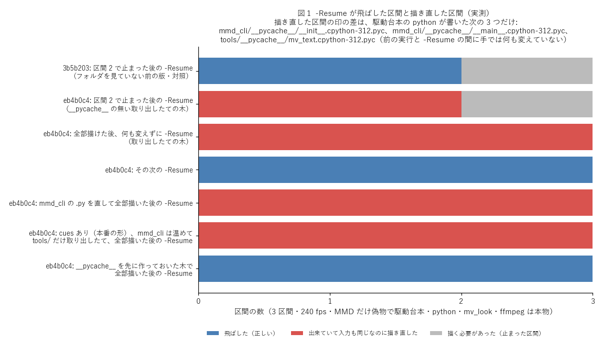
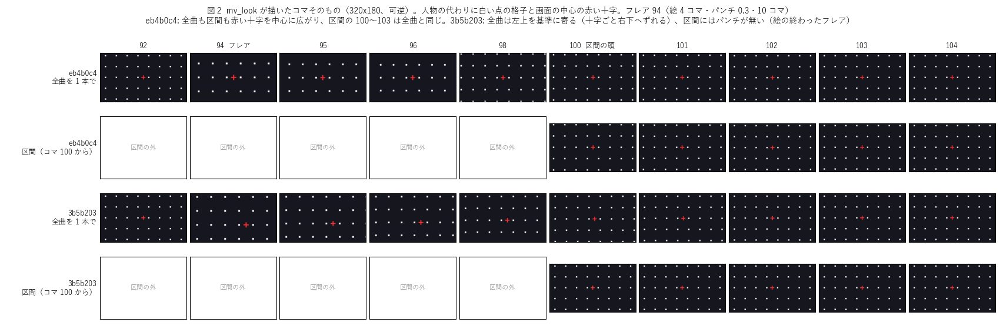
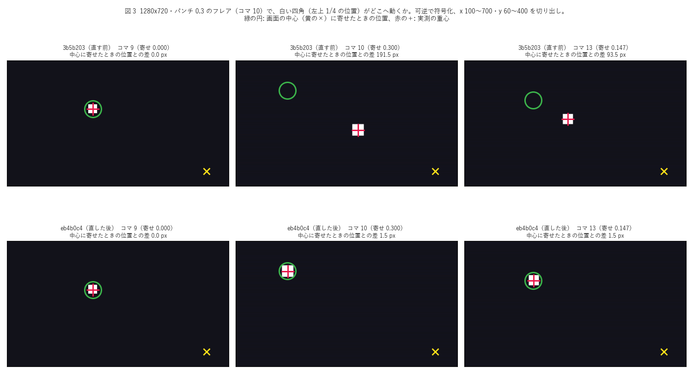

# 査読 12: 査読 11 への直し（枝 mv-chunks の eb4b0c4）の再査読

- 日付: 2026-10-07
- 対象: `git diff 3b5b203 eb4b0c4`。`tools/mv_chunks.py`（-Resume の印の範囲・out と scripts の位置の検査・`Invoke-Native`・look の事前の確かめ・
  残りと空きの止まり方・空の `.recipe`・`avi_bytes_per_pixel` の上限）、`tools/mv_look.py`（古い層の連番を消す・光の 1 入力と `trim`・パンチの
  crop の x・y・絵の終わったフレアのパンチ）、`tests/test_mv_chunks.py`（56 → 66 本）、`tests/test_mv_look.py`、README、査読 11 の記録と直しの表。
- 比較した main: 736d0a1（分かれ目 1145b60 からの差は HANDOVER.md だけ）。`git merge-tree --write-tree main mv-chunks` は衝突なし。
- やり方: 枝と main には何も書いていない（mv-chunks は eb4b0c4 のまま）。自分用の worktree（`scratchpad/review12`、eb4b0c4 の detached）で読み、
  全体の試験を 1 回だけ流し、終わりに `git worktree remove --force` で消した。変異と新旧の比べは `git archive` の写し（`r12/new` = eb4b0c4 の原本、
  `r12/mut` = 変異用。1 つ当てるたびに原本から戻した）と、査読 11 の写し `r11/new`（= 3b5b203）で走らせた。PowerShell 5.1.26100.9444（ja-JP）を
  `powershell -NoProfile -NonInteractive -File` で直接、Python 3.12.10、ffmpeg 8.1.2。MMD は起動していない。hinata には触れていない。試験は対象を
  絞って 1 つずつ流した（作業中の空きメモリは 3.7〜5.7 GB）。
- 「実地」は査読 11 の仕掛け（`r11/e2e/e2e11.py` と偽の MMD `fake_mmd_cli_main.py`）を `r12/e2e/e2e12.py` から読み込み、道具の木を eb4b0c4 に
  替えて走らせた結果。駆動台本・python・本物の `tools/mv_look.py`・ffmpeg・ffprobe は本物。

## 結論

- 判定: **マージは可。本番の描き直しにも使ってよい**（成果物を黙って間違える経路は見つからなかった）。ただし指摘 1 のため、
  **-Resume は「新しい版を入れて最初の実行」の後に限り、出来ていた区間も全部描き直す**。駆動台本の python 自身が、見ているフォルダ
  （`mmd_cli/`・`tools/`）に `__pycache__` を書くため。本番で -Resume に頼るなら、指摘 1 を直す（印から .pyc を外す。1 句）か、pull の後・
  描く前に描画機の mmd-cli の置き場で `python -m compileall -q mmd_cli tools` を 1 回流しておく。
- 重さの数: 高 0 / 中 1 / 低 4 / 情報 9。
- 査読 11 の 9 項目と情報のうち、1・2・4・5・6・7・8 と情報（look の誤りを先に、空の `.recipe`、1e300）は直った（査読 11 の再現の手順を
  当て直した。表は後ろ）。3（試験の穴）と 9（記述）は一部。
- 実装者の主張は再現した: 全体 864 本 OK（この worktree には `_spike` が無いので 8 本飛ばし）。未実行だった変異 3 つは 3 つとも落ちる。済んだ
  変異から抜き取った 3 つも落ちる。glow の閾値の理由（可逆なら 0.5 秒のコマは 1 画素も変わらない）も実測どおり。本番の計画から作り直した
  21 本のバッチ（parse 後）・畳みの引数 21 組・期待枚数（計 7,743）・連結の一覧（バイト一致）は本番の台本と一致した。
- 新しい問題は 2 つの型に分かれる。(a) 印の範囲を広げた結果、駆動台本自身が書くもの（`__pycache__`）まで入力として読む（1）。
  (b) 1 か所にまとめた外部コマンドの呼び方と look の確かめの、まだ当たっていない弱点と言い過ぎ（3・4・5）。試験の穴は前より狭いが残る（2）。

## 指摘

### 1. 中: 駆動台本の python が見ているフォルダに `__pycache__` を書き、次の `-Resume` が出来ている区間まで全部描き直す

- 場所: `tools/mv_chunks.py:77–86`（`watched_folders` が `<mmd_cli>/mmd_cli` と `<mmd_cli>/tools` を入れる）・`:296–300`
  （`$files += … Get-ChildItem -Recurse -File -Force …`、除外なし。`$stamp` は実行の頭で 1 回だけ取る）。書くのは同じ台本の `:335`
  （`python -m mmd_cli` → `mmd_cli/__pycache__/*.pyc`）と、cues があるときの `mv_look.py render`（`tools/mv_look.py:463–473` の
  `spec_from_file_location` と `exec_module` → `tools/__pycache__/mv_text.cpython-3XX.pyc`）。
- 仕組み: python は、.pyc が無いか、元の .py の時刻・大きさと合わないときに .pyc を書く。印は実行の頭で取るので、その実行で出来た区間の
  `.recipe` には書かれる前の印が入る。次の実行の印には書かれた .pyc が入り、全区間が「入力が変わった」になる。
- 筋書き（実地 `r12/e2e/e2e12.py`、3 区間・240 fps）:
  - `pyc`: 取り出したての木で全部描く → 何も変えずに `-Resume` → skipped []（3 区間とも描き直し）。`t_00.mp4.recipe` の差は
    `+ …\mmd_cli\__pycache__\__init__.cpython-312.pyc|241|…` と `+ …\__main__.cpython-312.pyc|5880|…` の 2 行だけ。その次の `-Resume` は
    3 区間とも飛ばす。`mmd_cli/__main__.py` に 1 行のコメントを足して全部描いた後の `-Resume` も skipped []（差は `__main__` の .pyc の時刻だけ）。
  - `failmid`: 区間 2 で止まった実行の後の `-Resume` が、出来ていた t_00・t_01 も描き直した。対照の 3b5b203（`failmid_prev`）は同じ手順で
    t_00・t_01 を飛ばす。
  - `cues_pyc`（本番と同じく cues あり、mmd_cli の .pyc は先に作っておく）: 畳みの mv_look が `tools\__pycache__\mv_text.cpython-312.pyc` を
    書き、`-Resume` は skipped []（印の差はこの 1 行だけ）。
  - 対照: .pyc を先に作っておいた木（mmd_cli は `compileall`、mv_text は 1 回 import）では、何も変えない `-Resume` は 3 区間とも飛ばし、
    繋いだ動画はバイト一致（`base_warm`）。図 1。
- 本番: 本番の計画の見ているフォルダは `…/UserFile/Model/Sour式鏡音リンVer.2.01`・`C:/work/hibikase/stage`・`C:/work/mmd-cli/mmd_cli`・
  `C:/work/mmd-cli/tools` で（`r12/out_regen12.txt`）、cues もある。描画機の checkout を pull で更新して mmd_cli/ か tools/mv_text.py が
  変わったあと（HANDOVER にある e3806b4 からこの枝へなら mmd_cli/ の 10 ファイルと tools/mv_text.py が変わる）、最初の実行が途中で止まると、
  `-Resume` は出来ていた区間も描き直す。全部描けて連結だけ失敗したとき（繋いだ動画を再生中で書けない等）も、連結のための `-Resume` が
  21 区間を描き直す（ヒビカセで約 30 分、README の hinata 実測）。2 回目以降の `-Resume` は効く。描画機で試験や道具を走らせて .pyc が
  変わったときも同じ。main の HANDOVER（736d0a1）では、査読 12 の後にマージして最終版を 240 fps で描き直す予定（480 fps なら約 1 時間・
  共用の C: を最大 34 GB）で、マージ後の pull の直後の実行がちょうどこの条件になる。hinata に `PYTHONDONTWRITEBYTECODE`・
  `PYTHONPYCACHEPREFIX` が設定されていないことは推論。
- 成果物は正しい（描き直すだけで、古いまま飛ばすことはない）。中の理由: 直しの目的の `-Resume` が、いちばん使う場面（新しい版での最初の
  実行の失敗）でちょうど効かない。README 425 行の「中にあると、書くたびに入力が変わったことになる」を、駆動台本自身が破っている。
- 試験が見逃す理由: DriverTest の python は PowerShell の関数で .pyc を書かない。EndToEndTest は本物の python を使うが、`-Resume` の試験は
  モーションを変えて全部描き直すことを期待するので、余計な描き直しが見えない。
- 根拠: 実地（`r12/out_pyc.txt`・`out_failmid.txt`・`out_e2e12_a.txt`・`out_e2e12_cues.txt`・`out_e2e12_b.txt`）。
- 直し方: (a) 印から .pyc を外す: `Get-ChildItem … -Recurse -File -Force … | Where-Object { $_.Extension -ne '.pyc' }`（元の .py は印に
  入っているので失うものは無い。`__pycache__` のフォルダ名で外してもよい）。(b) または駆動台本の頭で `$env:PYTHONDONTWRITEBYTECODE = '1'`
  （手で走らせた python が書く .pyc は防げないので (a) が確実）。試験: EndToEndTest で同じ計画を 2 回描き、2 回目の `-Resume` が 3 区間とも
  飛ばすこと（今のコードでは落ちる）。運用での回避: 上の `compileall`。

### 2. 低: 試験の穴（新しく作った 6 つの壊し方が全部の試験を通る）

- 場所: `tests/test_mv_chunks.py` の DriverTest（計画のモーション 2 本のうち変えるのは dance.vmd だけ、アクセサリは 1 つ、見ているフォルダの
  ファイルを変える場合はどれも大きさも変わる、隠しファイルは look だけ）。
- 変異（`r12/mut12.py`、写し `r12/mut` で 1 つずつ。DriverTest 30 本を通ったものは全 66 本も流した）:

  | 壊し方 | 結果 | 入ったら |
  | --- | --- | --- |
  | 印に入れるモーションを 1 本目だけにする（`plan["motions"][:1]`） | 通る（66 本 OK） | 本番の 3 本のうちリップ・視線を直しても -Resume が古い区間を使う |
  | アクセサリを 1 つ目だけにする（入力とフォルダの両方） | 通る | 2 つ目のアクセサリとそのテクスチャの変更を見ない |
  | 見ているフォルダのファイルの行から時刻を外す（大きさだけ） | 通る | 同じ大きさで描き直したテクスチャ（BMP・TGA のトゥーンやスフィアは色を変えても大きさが同じ）を見ない |
  | フォルダの再帰から `-Force` を外す | 通る | 隠し属性のテクスチャを見ない |
  | 連結だけ `Invoke-Native` でなく `&` で呼ぶ | 通る | 見つからない ffmpeg で前の 0 が残る（mv_look が先に ffmpeg で落ちるので届きにくい） |
  | 空きを測れないときの止まりを消す | 通る | 次の行で「-1 bytes free」と言って同じ終了 3 で止まる（文言だけ戻る） |

- 実装者の未実行の 3 つは 3 つとも落ちた（`r12/out_mut12_look1.txt`）: mv_look が `light_frames` を渡さない → ExcerptRenderTest、パンチを
  左上から → PunchCentreRenderTest と ExcerptRenderTest、絵のあるフレアだけパンチ → ExcerptRenderTest（こちらは査読 11 の前の振る舞いを
  そのまま戻した版。実装者の台本の版はパンチを全部消す、より強い変異）。ほかに作った mv_look の 3 つ（crop の y だけ `(ih-H)/2`、x だけ
  `(iw-W)/2`、`trim` の後の `setpts` を外す）も落ちた（`out_mut12_look2.txt`）。実装者の済んだ変異から抜き取った 3 つ（終了コードを空に
  しない・フォルダの行から大きさを外す・look を先に確かめない）も落ちた（`out_mut12_theirs.txt`）。
- 根拠: 実測（`r12/out_mut12_chunks.txt`。6 つとも全 66 本 OK）。
- 直し方: DriverTest の計画のモーション 2 本目（lips.vmd）と、別のフォルダの 2 つ目のアクセサリを、それぞれ変えて描き直す場合。テクスチャを
  同じ大きさのまま時刻だけ変える場合（モーションの場合と同じ形）。隠し属性のテクスチャ。空きを測れない場合は、`run_driver` の `before` で
  `Add-Type -TypeDefinition 'namespace MvChunks { public static class Disk { } }'` を先に定義すれば作れる（実地 `nofree` で確かめた）。
- 低の理由: 今のコードは正しい。上のうち 3 つ（表の 1〜3 行目）は、入れば -Resume が黙って古い区間を使うが、穴は査読 11 のときより狭い。

### 3. 低: `Invoke-Native` は「プログラム＋引数 1 つ」のとき、その引数を 1 文字ずつに分けて渡す（今の呼び出しには当たらない）

- 場所: `tools/mv_chunks.py:279–284`（`$exe, $rest = $args` と `& $exe @rest`）。
- 筋書き（実測 `r12/ps/inv12b.ps1`）: `$args` が 2 要素だと `$rest` は配列でなく文字列（System.String）になり、`@rest` はそれを文字ごとに
  展開する。`Invoke-Native python 'C:/x/y.py'` で python が受け取るのは `["C", ":", "/", "x", "/", "y", ".", "p", "y"]`。
  `Invoke-Native python --version` は `python - - v e r s i o n` になり、python は `-` で標準入力からスクリプトを読む（対話の端末では入力を
  待って止まる。`-NonInteractive` の実験では対話の入口を出して終わった）。引数 0 個と 2 個以上は正しい。
- 今の 4 か所（バッチ・look の確かめ・畳み・連結）はどれも引数が 6 個以上なので当たらない（潜在）。今後 `Invoke-Native ffprobe -version`
  のような 1 引数の呼び出しを足すと壊れる。
- 同じ `$args` 経由の受け渡しで分かったこと（今は使っていない）: 引用符なしの `--` は消える、`-x:y` は `-x:` と `y` に分かれる、空文字列の
  引数は消える（PS 5.1 の外部コマンド）。
- 直し方: `$exe, $rest = $args; $rest = @($rest)`、または `& $args[0] @($args | Select-Object -Skip 1)`（どちらも 1 引数・0 引数で正しいことを
  実測）。

### 4. 低: look の確かめは、失敗の理由によらず「the look does not work」と言う

- 場所: `tools/mv_chunks.py:301–302`。
- 筋書き（実地 `nopython`）: 計画の python のパスが違うと `STOP: the look does not work: …/look.json (mv_look layers, exit )`（終了コードは空）
  と、PowerShell の CommandNotFoundException が出る。look は正しい。tools/mv_look.py が無い、numpy・Pillow が無い、作業フォルダに書けない、
  計画の size が 1（mv_look が 2 未満を拒む）も同じ文言になる（推論）。試験
  `test_a_command_that_is_not_found_stops_the_run_even_after_an_exit_code_of_0`（`tests/test_mv_chunks.py:600–605`）はこの文言を期待している。
- 根拠: 実地（`r12/out_e2e12_a.txt`）。ほかの理由は推論。
- 直し方: `$LASTEXITCODE` が空なら「could not run <python>」、2 なら look の誤り（今の文言）、ほかは「mv_look layers failed」と分ける。

### 5. 低: 記述の食い違い

- README 437–440 行・説明文 33–37 行・駆動台本の頭の注: 見ないのは「フォントと MMD の設定」としているが、ほかにも見ないものがある。
  見ているフォルダの中の入れ子のジャンクション・シンボリックリンクの先（PS 5.1 の `Get-ChildItem -Recurse` は辿らない。実測
  `r12/ps/junc12.ps1`。モデルのフォルダそのものがジャンクションなら中は見る: `junc12b.ps1`）、モデルのフォルダの外を指すテクスチャ
  （相対の `..` や絶対パス。本番の Sour 式リン・レンの 4 つの PMX は全部フォルダの中: 実測 `pmx_tex12.py`）、MMD の `Data/` の共有トゥーン
  （推論）、python とそのライブラリ・ffmpeg の版。加えて駆動台本自身が書く `__pycache__` が印を変える（指摘 1）。
- README 435 行「外部コマンドは毎回、終了コードを空にしてから呼ぶ」: `Count-Frames` の ffprobe は `&` のまま（数を読むだけなので害は無い）。
- README 437 行「印はバッチ・look・畳みの引数の SHA-256」: SHA-256 に入るのは look のパスで、中身は大きさと時刻で見ている。
- 直しの表の 8「空きを測れない場合の試験は無い（出力フォルダがあれば測れるので作れない）」: 作れる（指摘 2）。
- 直しの表の下「x264 を通すと同じコマが 1.5 動いた」: 実測では glow ありのコマが 1.45、比べる側（plain、パンチ 0.1）のコマが 4.12 動き、
  余裕は 35.49 → 29.91（5.58 減）。結論（符号化の揺れで、0.5 秒のコマそのものは変わっていない）は合っている（情報 7）。

### 6. 情報

1. `out`・`scripts` の位置の判定（`r12/inside12.py`）: 大文字小文字・`\`・末尾の `/`・`Rin` と `Rin2`・字面のまま中に入る `../Rin/out` は
   正しい。中にあっても通る綴り: `x/../Rin/out`、`//`、`./`、末尾の `.` や空白（Windows は落とす）、UNC（`//localhost/C$/…`）、`\\?\`、8.3 名、
   `mmd-cli//tools/mv`。`mmd_cli_home` は調べない（mmd_cli が毎回書く）。どれも -Resume が毎回描き直す方へ外れる（安全側）。モデルが
   ドライブの根にあると見るフォルダは `D:` になり、PowerShell ではそのドライブの今の場所を指す（C: なら `Set-Location` 先の mmd-cli）。
2. 印の再帰: ジャンクションの輪は辿らないので止まらない（実測、2 ファイル・9 ms）。読めないサブフォルダは黙って抜け、読めるように
   なると描き直す（`acl12.ps1`）。`Sort-Object FullName` は同じ中身なら同じ並び（`-Resume` の実地の対照はすべて一致）。
3. 大きなフォルダ（`big12.ps1`、UserFile/Model 直下のモデルを想定）: 4,002 ファイルで印 0.41〜0.53 秒・`.recipe` 1 つ 0.65 MB、
   20,002 ファイルで 2.1〜2.5 秒・3.2 MB（21 区間で 65 MB）。本番のモデルのフォルダ（Sour 式リン）は配布 zip で 20 ファイル。
4. パンチの位置（`look/punch12.py`・図 3）: 320x180 と 1280x720、寄せ 0.04・0.3・1.0、フレア 1 つと重なる 2 つ、全曲と寄せの途中から始まる
   区間、glow の有無の 18 通りで、中心に寄せたときの位置から 1.5 px 以内。残る差は、大きさを偶数に切り捨てる分と、パンチの後の overlay が
   yuv420p を求めるため crop の x・y が偶数に切り下げられる分（寄せの x・y が奇数のコマで 1 px）。直す前（3b5b203）は 1280x720・0.04 で
   25 px、1280x720・0.3 の区間で 82 px、320x180・1.0 で 160 px。寄せ量が 0 以上なら x・y は 0 から（寄せた幅 − W）の間で、画面の外に出ない。
5. 奇数の大きさ（321x181）は直す前も後も ffmpeg が何も書かずに失敗する（322x182 は通る）。`check_plan` は奇数を通すので、MMD が区間 0 を
   描き終えてから分かる（look の確かめは層を書くだけなので見つけない）。計画で偶数を求めるとよい。
6. ExcerptRenderTest の余裕: 区間と全曲の差の最大 1.09 に対して閾値 1.5（中央値 0.98 が符号化の揺れ）。glow の試験と同じく x264 の先読みで
   動く大きさに近い。感度（隣のコマとの差）は 15.25 あるので、閾値を 4〜5 にするか、`-qp 0` で符号化して比べると環境の差に強くなる。
7. glow の閾値（`look/glow12.py`）: 可逆（`-qp 0`）では 0.5 秒のコマは前後で 0 画素違い（57,600 画素中）、余裕は 32.48。crf 16 では
   35.49 → 29.91。閾値 20 で余裕は約 10。
8. look の確かめの時間: 本番の大きさ（光 360 枚）で 22.5 秒（この PC）。全部飛ばす `-Resume` でも毎回かかる。look の誤りは読み込みと値の
   検査で出るので、`--size 2x2` と別の作業フォルダでも足りる（推論）。
9. 試験の時間: test_mv_chunks は DriverTest 30 本で 48〜74 秒、全 66 本で 75〜116 秒（査読 11 の 56 本は 49〜55 秒）。全体 864 本で 135 秒。

## 査読 11 の指摘ごとの直り具合

| 指摘（査読 11） | 直ったか | 当て直した手順と結果 |
| --- | --- | --- |
| 1 中 印に入らない入力 | 直った（新しい問題は指摘 1） | 査読 11 の `resume_inputs` を .pyc を温めた木で: テクスチャ（`tex.txt`）を書き換えて `-Resume` → 300 コマすべて新しい。mmd_cli の `MARK = "B"` → 300 コマすべて新しい。mv_look.py の時刻だけ → 全区間描き直し。温めないと、何も変えなくても全区間描き直す（指摘 1） |
| 2 中 作業フォルダの古い層 | 直った | 査読 11 の `stale.py`: ループ 2 秒の後に 1 秒で描くと光は 30 枚、コマ k と k+30 の差 1.73（新しいフォルダと同じ）。フレア 12 の後の 4 は 4 コマだけ光る |
| 3 中 試験の穴 | 一部 | 未実行の 3 つを含め、査読 11 の主な壊し方は落ちる。新しく作った 6 つは全部通る（指摘 2） |
| 4 中 パンチの基準点 | 直った | 査読 11 の `punch.py`: 全曲のフレアで 12.82、区間 100–102 は 27.33・28.72・30.28（全曲 27.31・28.73・30.28）。`punch12.py`・図 2・図 3 |
| 5 低 光のつなぎ目 | 直った | 査読 11 の `phase.py`・`phase16.py`: ループ 10 の全位相がサブフレーム 1・8・16 で正しい。`loop12.py`: ループ 10・7・360、継ぎ目を何度も越える 50〜130 コマ、全位相（360 は 0・1・3・249・357・359）、サブフレーム 1・8、助走つきで誤り 0 コマ（3b5b203 は前半 1・3 コマの位相で 956 コマ誤り）。実地 `light`: 区間と全曲の差は最大 3.85（符号化の揺れ） |
| 6 低 絵の終わったフレアのパンチ | 直った | `punch.py` の flare.frames 4 で区間にもパンチがあり全曲と一致。実地 `flare`: 区間と全曲の差（コマの平均）は最大 0.53（flare 4）・0.70（flare 12）で、査読 11 の直しの見本と同じ値（3b5b203 は 2.58・2.64） |
| 7 低 隠し属性 | 直った | `resume_inputs` の 4: 隠し属性のまま書き換えると全区間描き直し、`.recipe` の look の行は `…/look.json\|281\|…`（missing でない） |
| 8 低 文言 | 直った（残りは指摘 4） | 実地 `nofree`（型の無い空き）: `t_00 STOP: could not measure the free space of …` で終了 3、MMD は描かない。開かれた残り・読み取り専用・フォルダは試験で（全体の試験で OK） |
| 9 低 記述 | 一部 | 印の範囲・mv_text・光とパンチの記述は直った。印の外にまだあるもの・`__pycache__` は指摘 1・5 |
| 10 情報 | 直った | 実地 `lookfail12`: 知らない設定 `glw` で `STOP: the look does not work … (mv_look layers, exit 2)` と理由の JSON、終了 1、out は空、偽の MMD は 1 回も呼ばれない。空の `.recipe`・1e300 は試験 |

## 確かめて問題が無かった点

### 1. 実装者の主張の再現

| 主張 | 結果 |
| --- | --- |
| 全体 864 本 OK（1 本は以前からの飛ばし） | 864 本 OK・135 秒。この worktree では 8 本飛ばし（7 本は `_spike` の実データの試験。作業木の差） |
| 変異 27 のうち済んだ 24 で 23 が落ち、生き残り 1 つは場合を足して落とした | 抜き取りの 3 つ（終了コードを空にしない・フォルダの行から大きさを外す・look を先に確かめない）は落ちる。「フォルダの行から大きさを外す」は足した場合（古い時刻のままのテクスチャの大きさ）で落ちる |
| 未実行の 3 つは直す前の mv_look で落ちる試験がある | 3 つとも落ちる（指摘 2） |
| glow の閾値: 可逆なら 0.5 秒のコマは変わらず、x264 で動く | 可逆で 0 画素違い。crf 16 の余裕は 35.49 → 29.91（情報 7） |
| 本番の台本と一致（査読 11 で確かめた 21 本） | eb4b0c4 で作り直しても、バッチ 21 本（parse 後）・畳みの引数 21 組・期待枚数（計 7,743）・連結の一覧（バイト一致）が本番と一致（`out_regen12.txt`） |

### 2. 依頼で挙がった所

- `Invoke-Native`（`r12/ps/inv12.ps1`）: 0 個（`hostname`）と 2 個以上は正しい。`-m`・`--out`・`--size 1280x720`・`--fps 30`・
  `-v error -y -f concat -safe 0 -i … -c copy`・`-Verbose -ErrorAction Stop -OutVariable x` はどれも PowerShell のパラメーターとして食われず、
  そのまま外部コマンドに届く。空白・全角（ヒビカセ・U+3000）・’・`[1]`・`{0}`・`$x;&(1)` を含む畳みの引数も壊れない。`| Out-Null`・
  `| Set-Content`・変数への取り込み・関数の中のどれでも `$LASTEXITCODE`（3・7）は呼び手に届く。見つからないコマンドは前の 0 の後でも
  `$LASTEXITCODE` が空になって止まる（`| Set-Content` の先のファイルは作られない）。試験の偽物（PowerShell の関数）も外部コマンドと同じ並びの
  引数を受け取る。1 引数だけが指摘 3。
- look の事前の確かめ: 引数は本物の CLI（`layers LOOK WORK --size WxH --fps N`、`tools/mv_look.py:543–547`）と合う。作業フォルダ
  `out/look_work_<tag>` は out の中なので見ているフォルダに入らない（out は計画で検査）。out に ’・`[1]`・`{0} $x;&(1)`・日本語・全角空白、
  look に U+301C・é、out と look を UNC にした実地も最後まで走り、.pyc を温めた木では `-Resume` が全部飛ばし、look の変更で全部描き直す
  （`out_e2e12_special_unc.txt`）。文言だけが指摘 4。
- 印の再帰: 輪・読めないフォルダ・並び・大きさは情報 2・3。ジャンクションの先は指摘 5。
- `out` と `scripts` の判定: 情報 1。取り違えはどれも安全側。
- 消せない残り: `-Force` で読み取り専用は消え、ほかのプログラムが開いている残りは理由を出して止まり（`t_00: removed` は出ない）、AVI の名前の
  フォルダでも止まる（試験、全体で OK）。`-Filter 't_00.avi.mmdcli-failed*'` は名前のすぐ後が `.avi` なので `t_000…` に当たらない（試験で
  `t_000.avi.mmdcli-failed` と `t_00.avi.mmdcli-old` は残る）。
- 光の `trim`: `-stream_loop -1` の入力から `trim=start_frame=位相` で頭を落とすと、ループの継ぎ目を何度越えても位相は保たれる（`loop12.py`、
  サブフレーム 1・8。`phase16.py` で 16）。全曲（位相 0）は `trim` を付けず、直す前（3b5b203）と光の入力も式も同じ（`look/argv12.py`:
  本番の look で全曲・`--from 0`・サブフレーム 8 の 3 通りはパンチの crop のほか一致、フレアの無いループの頭ちょうどの抜粋は argv が完全に一致）。
- パンチの crop の式: 情報 4。寄せ量 0 のコマは寄せる前と同じ位置（差 0.0 px）。
- 絵の終わったフレアのパンチの範囲: `since > -punch_span` は、パンチの終わりが区間の頭ちょうどのフレアを外す（入れても t=0 の寄せは 0）。
  `--from` の `%.6f`（3.333333）で境目の内側に入る場合も、式の値は 0 で絵は変わらない（推論、式の計算）。`duration` の後に始まるフレアは
  入らない。重なる 2 つのフレアは scale と crop の両方で同じ和になる（`punch12.py` の重なりの場合で 1.5 px 以内）。`punch_frames` が 0 なら
  前と同じくパンチも色ずれも無い。

### 3. 実地（MMD だけ偽物）

| ケース | 結果 |
| --- | --- |
| `base_warm`（査読 11 の `base`、.pyc を温めた木） | 300 コマすべて自分のコマ。何も変えない `-Resume` は 3 区間とも飛ばし、繋いだ動画はバイト一致。完成した区間の脇の AVI は飛ばすときに消える |
| `resume_inputs_warm` | 査読 11 の表の 1 行目のとおり |
| `special`・`unc`（温めた木） | 最後まで走り、`-Resume` で全部飛ばし、look の変更で全部描き直す |
| `light`・`flare` | 区間と全曲の差は最大 3.85（光、上半分）・0.53・0.70（フレア、コマ全体）で、査読 11 の直しの見本と同じ値（符号化の揺れ） |
| `lookfail12`・`nofree`・`nopython` | 査読 11 の表の 10・8 の行と指摘 4 |
| `pyc`・`failmid`・`failmid_prev`・`cues_pyc` | 指摘 1 |

## 確かめられなかったこと

- hinata（決まりで触れない）: 環境変数（`PYTHONDONTWRITEBYTECODE`・`PYTHONPYCACHEPREFIX`）、今の checkout、`__pycache__` があるか、本物の MMD が
  モデルのフォルダに何か書くか。本番のモデルのフォルダは配布 zip で代用した。
- 対話の端末（`-NonInteractive` なし）で、mp4・`.recipe`・`.look.json` の名前の中身のあるフォルダを `Remove-Item` が消すときの確認の出方
  （前の版からある。AVI と `.mmdcli-failed` は今回止まるようになった）。

## 図

図 1（図示）: 3 区間の実地で、`-Resume` が飛ばした区間（青）と、出来ていて入力も同じなのに描き直した区間（赤）。描き直した回の印の差は、
駆動台本の python が書いた `__pycache__` の .pyc だけ。.pyc を先に作っておいた木では全部飛ばす。

図 2（実物）: mv_look が描いたコマそのもの（320x180、可逆で符号化）。人物の代わりに白い点の格子と画面の中心の赤い十字。フレア 94（絵 4 コマ、
パンチ 0.3・10 コマ）。eb4b0c4 は全曲も区間も赤い十字を中心に広がり、区間の 100〜103 は全曲と同じ。3b5b203 は全曲が左上を基準に寄り
（十字ごと右下へずれる）、区間にはパンチが無い。

図 3（実物に図示）: 1280x720・パンチ 0.3 のフレア（コマ 10）で、左上 1/4 にある白い四角がどこへ動くか。緑の円は画面の中心（黄の ×）に
寄せたときの位置、赤の ＋ は実測の重心。3b5b203 はコマ 10 で 191.5 px、コマ 13 で 93.5 px 外れ、eb4b0c4 は 1.5 px 以内。

## 台本と出力（すべて `scratchpad/r12/`）

| 台本 | 中身 | 出力 |
| --- | --- | --- |
| `e2e/e2e12.py`（`r11/e2e/e2e11.py` を読み込む） | 実地: `pyc`・`failmid`・`failmid_prev`・`cues_pyc`・`nopython`・`lookfail12`・`nofree`・`base_warm`・`resume_inputs_warm`・`special_unc_warm`、査読 11 の `light`・`flare` | `out_pyc.txt`・`out_failmid.txt`・`out_e2e12_a.txt`・`out_e2e12_b.txt`・`out_e2e12_cues.txt`・`out_e2e12_special_unc.txt`・`out_e2e12_light_flare.txt` |
| `mut12.py` | 変異（写し `mut/` で 1 つずつ、原本 `new/` から戻す） | `out_mut12_look1.txt`・`out_mut12_look2.txt`・`out_mut12_chunks.txt`・`out_mut12_theirs.txt` |
| `ps/inv12.ps1`・`ps/inv12b.ps1`（`ps/echoargs.py`） | `Invoke-Native` の引数と終了コード | `ps/inv12_out.txt`・`ps/inv12b_out.txt` |
| `ps/junc12.ps1`・`ps/junc12b.ps1`・`ps/acl12.ps1`・`ps/big12.ps1` | 印の再帰（ジャンクション・読めないフォルダ・大きなフォルダ） | `ps/junc12_out.txt`・`ps/junc12b_out.txt`・`ps/acl12_out.txt`・`ps/big12_out.txt` |
| `inside12.py` | out・scripts の位置の判定 | `out_inside12.txt` |
| `look/loop12.py` | 光の位相（長い区間・継ぎ目・サブフレーム） | `out_loop12.txt`・`out_loop12_prev.txt`（3b5b203） |
| `look/punch12.py` | パンチの位置（中心に寄せたときとの差） | `out_punch12.txt`・`out_punch12_prev.txt`（3b5b203） |
| `look/glow12.py` | glow の試験の余裕（crf 16 と可逆） | `out_glow12.txt` |
| `look/argv12.py` | 3b5b203 と eb4b0c4 の argv | `out_argv12.txt` |
| 査読 11 の `look/stale.py`・`look/punch.py`・`look/phase.py`・`look/phase16.py`（`r12/new` を渡して） | 査読 11 の再現の手順の当て直し | `out_stale_r11_on_new.txt`・`out_punch_r11_on_new.txt`・`out_phase_r11_on_new.txt`・`out_phase16_r11_on_new.txt` |
| `regen12.py`・`pmx_tex12.py` | 本番の台本との比べ・本番のモデルのテクスチャの場所 | `out_regen12.txt`（作り直した台本は `regen/`）・`out_pmx_tex12.txt` |
| `figs12.py` | 図 1〜3 | `figs/` |
| （全体の試験） | `python -B -m unittest discover -s tests -t .`（worktree で 1 回） | `out_full_suite.txt` |

## 査読 12 への直し（実装者、2026-10-07、枝 mv-chunks-r12 の 5ea6000）

| 指摘 | 直し | 確かめ方 |
| --- | --- | --- |
| 1 中 `__pycache__` で次の `-Resume` が全区間を描き直す | 印の対象から `__pycache__` を外す（`Where-Object { $_.FullName -notmatch '__pycache__' }`） | 描き直しの試験に「python が書くバイトコードだけ」の場合（0 区間） |
| 2 低 生き残った 6 つの変異 | 試験の場合を足した: 2 本目のモーション・2 つ目のアクセサリのフォルダ・同じ大きさで後の時刻のテクスチャ・隠したテクスチャ、連結のコマンドが無い（PATH から外す）、空きを測れない（失敗する `MvChunks.Disk` を先に置く） | 6 つとも、写しの作業木で当てて落ちた |
| 3 低 `Invoke-Native` の 1 引数 | 残りの引数は `@($args \| Select-Object -Skip 1)` | `Invoke-Native` を取り出して、1 引数・0 引数・空白を含む 2 引数を渡す試験（直す前は 'one argument' が 12 文字に割れた） |
| 4 低 python が無いとき「look が壊れている」と言う | 走らなかったコマンドは「did not run」（look の検査・バッチ・mv_look・連結） | 試験を直した（「did not run」を見て、「the look does not work」が無いこと） |
| 5 低 記述 | 説明文と README に、`-Resume` が見ないものを足した（フォント・MMD の設定・Python とその部品・ffmpeg・見ているフォルダの外・その中のジャンクションの先・`__pycache__`） | ― |
| 情報 奇数の大きさ | 計画で偶数を求める（yuv420p） | 試験 1 本 |
| 情報 区間と全曲の比べの余裕 | 許容 1.5 → 2.0（x264 の揺れ 1.1、位相の誤りは 4〜19） | ― |

- 今回の変異 11（査読 12 の生き残り 6 と、今回の直しの 5）は、写しの作業木（scratchpad の `mut_r12`）で当てて 11 とも落ちた。
  前回メモリ不足で止められた走りが作業木の道具を変異のまま残した（実装者が控えから戻した）ので、今回は写しの中だけで書き換えた。
- 全体の試験 868 本 OK（1 本は以前からの飛ばし）。
- この直しは査読を受けていない（小さい直しと試験・記述。変異で確かめた）。

